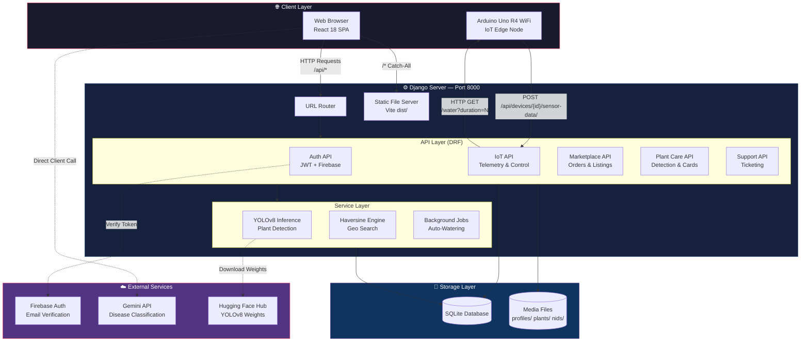
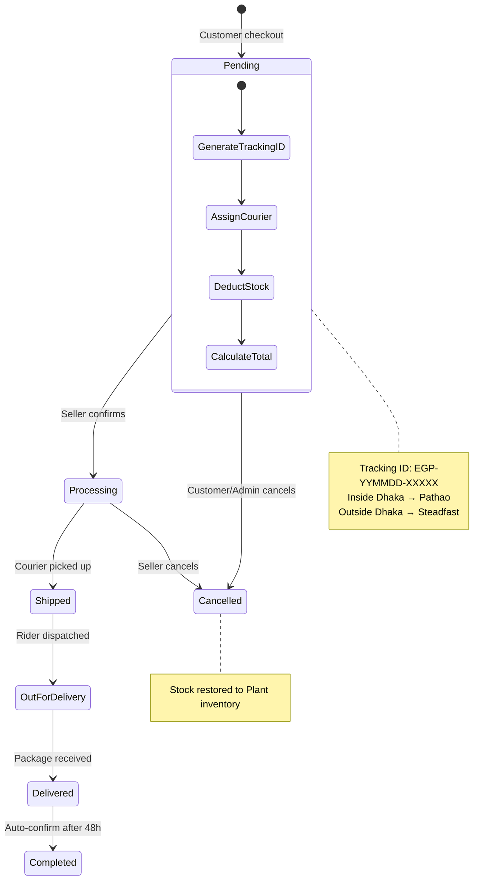
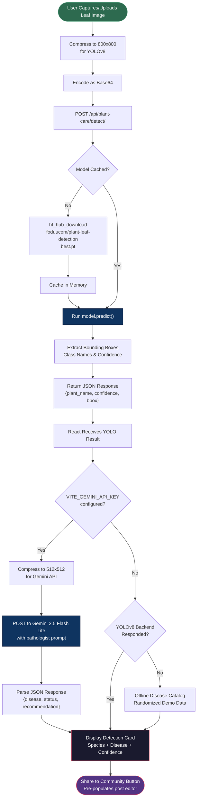
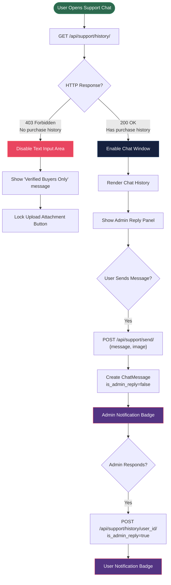
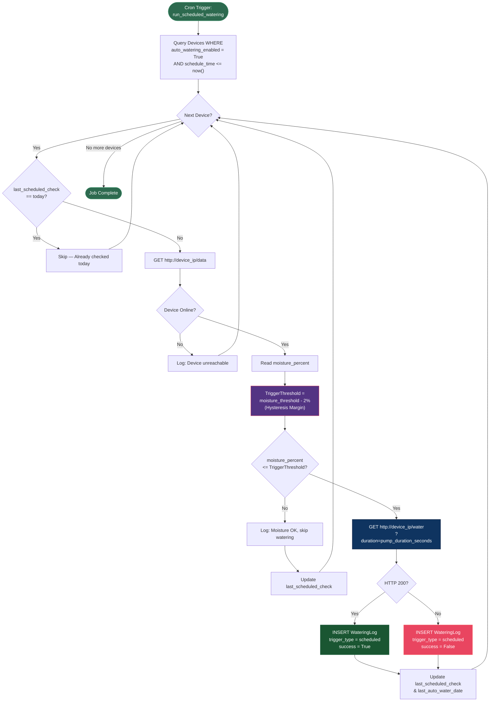

```mermaid
sequenceDiagram
    participant User as 👤 User
    participant Script as 📜 run.bat
    participant Python as 🐍 Python/Django
    participant Node as 📦 Node/Vite
    participant Browser as 🌐 Browser
    participant Arduino as 🔧 Arduino

    User->>Script: Double-click run.bat
    
    rect rgb(26, 26, 46)
    Note over Script,Python: Environment Setup
    Script->>Script: Check Python 3.x exists
    Script->>Script: call .venv\Scripts\activate
    Script->>Python: pip install -r requirements.txt
    Python-->>Script: Dependencies installed ✅
    end

    rect rgb(22, 33, 62)
    Note over Script,Python: Database Setup
    Script->>Python: python manage.py migrate
    Python-->>Script: SQLite schema synced ✅
    end

    rect rgb(15, 52, 96)
    Note over Script,Node: Frontend Build
    Script->>Script: Delete .vite cache folder
    Script->>Node: cd frontend && npm run build
    Node-->>Script: dist/ compiled ✅
    end

    rect rgb(83, 52, 131)
    Note over Script,Arduino: Network Discovery
    Script->>Script: ipconfig → Parse IPv4
    Script->>Script: Display LAN IP for Arduino config
    Note right of Script: e.g. 192.168.1.15
    end

    rect rgb(26, 26, 46)
    Note over Script,Browser: Server Launch
    Script->>Python: python manage.py runserver 0.0.0.0:8000
    Script->>Script: Wait 5 seconds
    Script->>Browser: start http://127.0.0.1:8000
    Browser-->>User: App loaded 🚀
    end
```

# Easy Grow Plants: Comprehensive Technical & Thesis Documentation
## Phase 1 — Project Overview, Core Architecture, and Hardware/Firmware Details

---

## 1. Project Abstract & Ecosystem Overview

### 1.1 Project Introduction
"Easy Grow Plants" is an integrated, multi-tier Internet of Things (IoT) and Artificial Intelligence (AI) plant care ecosystem and peer-to-peer (P2P) marketplace platform. It is designed to address the challenges of urban gardening, plant care management, and horticultural trading within modern high-density residential ecosystems. As cities grow, access to open green space declines, encouraging balcony and indoor container gardening. However, novice gardeners face two main barriers: high plant mortality rates due to a lack of precise biological insight, and the absence of a specialized, localized marketplace for exchanging plants and horticultural advice.

This ecosystem addresses these challenges by integrating:
1. **Physical Smart Pots**: Low-cost, high-stability IoT hardware nodes that sense soil moisture and environmental states, executing automated and manual irrigation.
2. **Dynamic Web Application**: A full-stack management panel offering real-time telemetry display, virtual care calendars, plant diagnostics, compass-guided sunlight matching, and a niche P2P exchange marketplace.

### 1.2 Core Problems Solved
- **Biological Neglect & Visual Guesswork**: Traditional plant care relies on manual estimation of soil moisture, which often leads to root rot (from overwatering) or dehydration (from underwatering). This platform implements a continuous 24/7 telemetry loop to track moisture percentages.
- **Horticultural Knowledge Barrier**: The platform includes a species-aware care guide, an AI leaf disease diagnostic tool, and a compass-integrated recommendation system that suggests plants compatible with a balcony's exact orientation and sunlight levels.
- **Hyperlocal Marketplace Fragmentation**: Traditional e-commerce sites lack verified, niche communities for plant lovers. This system features a P2P exchange portal for cash-free plant swaps, an integrated shipping pickup requester (ShipFast), and localized nursery mapping.
- **Sensor Signal Noise**: Low-cost analog sensors exhibit electrical noise and jitter, which can cause false irrigation triggers. The system solves this with double-layer digital filtering (Median sorting and Exponential Moving Averages).

### 1.3 System Target Users
- **Urban Hobbyists**: Beginners and balcony gardeners seeking remote monitoring and automated watering.
- **Home Nurseries & Sellers**: Local sellers who need listing tools, automated order tracking, shipping pickup, and secure payouts.
- **Active Community Swappers**: Plant enthusiasts who want to trade cuttings, pups, or mature varieties without cash transactions.
- **Verified Botanists**: Qualified professionals who review community posts and offer expert horticultural guidance.

---

## 2. Software Tech Stack & Single-Origin Architecture

### 2.1 Technical Stack Specification

| Component Layer | Technology / Library | Rationale & Selection Criteria |
| :--- | :--- | :--- |
| **Frontend Framework** | React 18 (Vite-powered) | Virtual DOM state management enables rapid telemetry UI updates (5s intervals) without page reloads. |
| **Styling Framework** | Tailwind CSS | Utility-first styling supports fluid layouts, responsive dashboards, and custom theme overrides. |
| **Icons & Media** | Lucide React | Provides vector-based iconography across all screens. |
| **API Client** | Axios | Configured with a relative path `baseURL: '/api'` for simplified backend request pooling. |
| **Backend Core** | Django 5.x | Highly secure, rapid-development framework implementing MVC principles and a powerful ORM. |
| **API Engine** | Django REST Framework (DRF) | Generates clean, stateless JSON API interfaces for web clients and IoT hardware. |
| **Authentication** | Firebase Auth & JWT | Dual auth strategy: Firebase handles user registration, email verification, and client-side credential checks. Django issues JWT tokens for session verification. |
| **Database** | SQLite | Serverless relational engine ideal for local deployment, development, and testing. |
| **Biometric Lib** | Face-api.js | Runs neural networks in the browser to compare webcam captures with NID card faces. |
| **Image Processing** | OpenCV (cv2) & NumPy | Optional Python backend libraries for verifying biometric data and analyzing plant leaf geometry. |
| **Local Machine Learning**| Ultralytics YOLOv8 | Runs local edge inference for real-time species classification and leaf disease bounding box detection. |
| **Mapping Library** | Leaflet & React-Leaflet | Open-source mobile-friendly interactive maps for plotting nearby seller geolocations. |

### 2.2 Same-Origin (Single-Origin) Architecture Design
In the initial project stages, the system ran in a decoupled double-server setup: a Django backend on port 8000 and a Vite development server on port 5173. This required complex Cross-Origin Resource Sharing (CORS) configurations, dual-process management, and local proxy setups.

The project has been refactored into a **Single-Origin Architecture** where Django manages both API routing and React static file delivery on a single port (`http://127.0.0.1:8000`).

```
┌────────────────────────────────────────────────────────────────────────┐
│                          User's Web Browser                            │
│                      (Accesses http://127.0.0.1:8000)                  │
└───────────────────────────────────┬────────────────────────────────────┘
                                    │
                                    ▼
       ┌──────────────────────────────────────────────────────────┐
       │             Django Web Server (Port 8000)                │
       │                                                          │
       │  URL Router Namespace Division:                           │
       │  ┌─────────────────────────┐  ┌───────────────────────┐  │
       │  │    /api/*               │  │    /admin/            │  │
       │  │    (DRF REST Endpoints) │  │    (Admin Interface)  │  │
       │  └────────────┬────────────┘  └───────────┬───────────┘  │
       │               │                           │              │
       │  ┌────────────▼────────────┐  ┌───────────▼───────────┐  │
       │  │    /assets/*            │  │    /* (Catch-All)     │  │
       │  │    (Vite JS/CSS Files)  │  │    (Serves index.html)│  │
       │  └────────────┬────────────┘  └───────────┬───────────┘  │
       └───────────────┼───────────────────────────┼──────────────┘
                       │                           │
                       ▼                           ▼
        ┌─────────────────────────────┐ ┌─────────────────────────────┐
        │   Static Serving Folder     │ │   Vite Compiled SPA Bundle  │
        │   (frontend/dist/assets)    │ │   (frontend/dist/index.html)│
        └─────────────────────────────┘ └─────────────────────────────┘
```

#### Key Implementation Changes
1. **Django Static Configuration (`backend/core/config/settings.py`)**:
   - `STATIC_URL` is set to `'/'` to match Vite's root asset deployment.
   - `STATICFILES_DIRS` is configured to point directly to the Vite compilation folder:
     ```python
     STATICFILES_DIRS = [
         BASE_DIR.parent / 'frontend' / 'dist',
     ]
     ```
   - CORS middleware headers are commented out because the frontend browser page and backend API share the same origin, eliminating browser preflight checks.

2. **Unified URL Routing (`backend/core/config/urls.py`)**:
   - Django handles `/admin/` and `/api/` (which routes requests to `DeviceViewSet`, `OrderViewSet`, etc.).
   - A catch-all regular expression catch route is declared at the end of the pattern list:
     ```python
     from django.views.generic import TemplateView
     from django.urls import re_path
     
     def react_app_view(request):
         return render(request, os.path.join(settings.BASE_DIR.parent, 'frontend', 'dist', 'index.html'))
         
     urlpatterns = [
         path('admin/', admin.site.urls),
         path('api/', include(router.urls)),
         re_path(r'^.*$', react_app_view), # Catch-all React router bridge
     ]
     ```
   - All non-API requests (such as `/marketplace`, `/dashboard`, `/exchange-dashboard`) are directed to React's compiled `index.html`. The client's React Router then intercepts and handles URL routing on the client side.

3. **Vite Production Bundler Setup (`frontend/vite.config.js`)**:
   - The build base path is set to root (`base: '/'`).
   - The build output directory is set to `dist`, ensuring that running `npm run build` generates output directly inside `frontend/dist/` where Django's static files system can locate it.

### 2.3 System Architecture Diagram



---

## 3. Hardware Architecture, Circuit Connections, and Calibration Logic

### 3.1 Microcontroller & Core Hardware Components
The IoT Smart Pot edge node uses the following hardware stack:
- **Arduino Uno R4 WiFi**: Uses a 32-bit Renesas RA4M1 ARM Cortex-M4 CPU (running at 48 MHz) and has an onboard ESP32-S3 module that handles Wi-Fi stack operations.
- **Capacitive Soil Moisture Sensor (v1.2)**: Estimates soil volumetric water content by measuring capacitive changes in the soil medium. Capacitive sensors are used instead of resistive sensors because their polymer-coated electrodes resist corrosion.
- **5V Relay Module**: Isolates the low-current digital pins of the microcontroller from the higher current demands of the irrigation pump.
- **Submersible DC Water Pump**: A compact 3V-6V water pump connected to a water reservoir.

### 3.2 Schematic Pin Connections
Physical components are wired according to this configuration:
```
  [Capacitive Moisture Sensor v1.2]
  ┌───────────────┐
  │      SIG (A)  ├──────────────────────────► Arduino Analog Pin A0
  │      VCC      ├──────────────────────────► Arduino Pin 3.3V
  │      GND      ├──────────────────────────► Arduino Pin GND
  └───────────────┘

  [5V Single-Channel Relay Module]
  ┌───────────────┐
  │      IN (SIG) ├──────────────────────────► Arduino Digital Pin D7
  │      VCC      ├──────────────────────────► Arduino Pin 5V
  │      GND      ├──────────────────────────► Arduino Pin GND
  └───────┬───────┘
          │ (Common NC/NO Contacts)
          ▼
   [+5V Power Source] ───► [Relay Common] ───► [Relay NO] ───► [DC Pump +]
   [GND Power Source] ────────────────────────────────────────► [DC Pump -]
```
*Note: The relay operates on **Active-LOW** logic. A logic `LOW` on digital pin 7 activates the relay coil, closing the Normally Open (NO) path to complete the pump circuit.*

### 3.3 Double-Layer Digital Signal Processing (DSP)
Analog readings from soil moisture sensors are susceptible to electromagnetic interference (EMI) and power supply fluctuations. To ensure signal integrity, the C++ firmware applies two consecutive filtering algorithms:

#### Layer 1: Median Filtering (Outlier Removal)
Instead of relying on single readings, the Arduino gathers a burst of 30 samples at 5ms intervals. It sorts these values using a basic bubble sort and calculates the average of the middle 10 samples (indices 10 to 19). This process discards high-frequency electrical spikes and outlying sensor noise.

```cpp
int readFilteredRaw(int pin) {
  const int SAMPLES = 30;
  int rawList[SAMPLES];
  
  for(int i = 0; i < SAMPLES; i++) {
    rawList[i] = analogRead(pin);
    delay(5);
  }
  
  // Sort samples in ascending order
  for (int i = 0; i < SAMPLES - 1; i++) {
    for (int j = 0; j < SAMPLES - i - 1; j++) {
      if (rawList[j] > rawList[j + 1]) {
        int temp = rawList[j];
        rawList[j] = rawList[j + 1];
        rawList[j + 1] = temp;
      }
    }
  }
  
  // Calculate average of the middle 10 samples
  long sum = 0;
  for(int i = 10; i < 20; i++) {
    sum += rawList[i];
  }
  return sum / 10;
}
```

#### Layer 2: Exponential Moving Average (EMA)
To smooth sensor output over time, the system passes the median-filtered raw value into an EMA filter. This step dampens sudden transitions and yields a stable value:
$$\text{SmoothedRaw}_t = (\alpha \times \text{RawMedian}_t) + ((1 - \alpha) \times \text{SmoothedRaw}_{t-1})$$
In this system, $\alpha$ is set to `0.2`. This value provides a balance, dampening high-frequency jitter while responding to actual soil moisture changes.

### 3.4 Calibration & Constrained Mapping
Soil moisture percentage mapping uses dry and wet calibration limits established through empirical testing:
- **`DRY_RAW`**: Calibration limit in air, set to **`375`** (mapped to 0% moisture).
- **`WET_RAW`**: Calibration limit in water, set to **`310`** (mapped to 100% moisture).

The software maps and clamps these limits to protect database integrity:
```cpp
int getMoisturePercentage(float smoothedRaw) {
  // Map and constrain values between WET_RAW and DRY_RAW
  int percentage = map((int)smoothedRaw, DRY_RAW, WET_RAW, 0, 100);
  return constrain(percentage, 0, 100);
}
```

### 3.5 Firm-Safe Actuator Protections & Network Timing
To prevent flooding from hardware faults or network communication drops, the firmware implements three protection mechanisms:

1. **Digital Pin Safety Pull-Up**:
   Because the relay uses Active-LOW logic, setting digital pin 7 as a standard output can briefly pull it LOW during system initialization, triggering the water pump. To prevent this, the firmware sets the pin state to `HIGH` before initializing it as an output:
   ```cpp
   digitalWrite(RELAY_PIN, HIGH);
   pinMode(RELAY_PIN, OUTPUT);
   ```

2. **Hard Pump Duration Clamping**:
   Any incoming HTTP watering request (e.g., `/water?duration=15`) is constrained. The pump's runtime is clamped between a minimum of **1 second** and a maximum of **10 seconds**.

3. **Watering Cooldown Timer**:
   The firmware monitors pump cycles. After the pump runs, the system enforces a mandatory **60-second cooldown period** during which all watering commands are ignored. This delay allows water to absorb into the soil and prevents pump damage.

### 3.6 IoT Telemetry & Control Data Flow

```mermaid
sequenceDiagram
    participant Sensor as 🌱 Capacitive Sensor
    participant MCU as 🔧 Arduino Uno R4 WiFi
    participant Django as ⚙️ Django Server
    participant DB as 💾 SQLite
    participant UI as 🌐 React Dashboard
    participant Pump as 💧 Water Pump

    rect rgb(26, 26, 46)
    Note over Sensor,MCU: Signal Processing Pipeline
    Sensor->>MCU: Raw Analog Reading (A0)
    MCU->>MCU: Median Filter (30 samples → middle 10)
    MCU->>MCU: EMA Smoothing (α = 0.2)
    MCU->>MCU: Constrained Map (310–375 → 0–100%)
    end

    rect rgb(22, 33, 62)
    Note over MCU,DB: Telemetry Upload (Every 5s)
    MCU->>Django: POST /api/devices/{id}/sensor-data/<br/>{moisture, soil_raw, temp, water_level, pump_status}
    Django->>DB: INSERT DeviceReading
    Django->>Django: Update device.last_seen & ip_address
    Django-->>MCU: 201 Created
    end

    rect rgb(15, 52, 96)
    Note over UI,Pump: Manual Watering Command
    UI->>Django: POST /api/devices/{id}/water/ {duration: 5}
    Django->>Django: Verify ownership & cooldown (60s)
    Django->>MCU: GET http://{device_ip}/water?duration=5
    MCU->>MCU: Clamp duration (1–10s)
    MCU->>Pump: Relay LOW → Pump ON
    MCU->>MCU: delay(duration * 1000)
    MCU->>Pump: Relay HIGH → Pump OFF
    MCU-->>Django: 200 OK
    Django->>DB: INSERT WateringLog (manual)
    Django-->>UI: 200 OK {success: true}
    end
```



---

## Phase 2 — Database Models & API Schema Specification

---

## 4. Detailed Database Entity Relationships and Models

The database for "Easy Grow Plants" uses a relational database schema designed to support high-frequency time-series IoT writes, e-commerce transaction security, P2P exchange proposals, and community interactions.

```mermaid
erDiagram
    CustomUser ||--o{ Device : "owns"
    CustomUser ||--o{ Plant : "sells"
    CustomUser ||--o{ Order : "places"
    CustomUser ||--o{ ExchangePost : "creates"
    CustomUser ||--o{ ExchangeProposal : "sends"
    CustomUser ||--o{ ChatMessage : "support_chats"
    CustomUser ||--o{ DynamicCareCard : "care_cards"
    CustomUser ||--o{ Subscription : "subscribes"
    CustomUser ||--o{ Notification : "receives"
    CustomUser ||--o{ SellerPaymentMethod : "payment_methods"
    CustomUser ||--o{ PaymentRequest : "payout_requests"
    CustomUser ||--o{ ShipFastRequest : "shipping_requests"

    Device ||--o{ DeviceReading : "readings"
    Device ||--o{ WateringLog : "watering_logs"

    Order ||--o{ OrderItem : "items"
    OrderItem }o--|| Plant : "references"

    ExchangePost ||--o{ ExchangeProposal : "proposals"
    ExchangeProposal ||--o{ ExchangeProposalMessage : "messages"

    CustomUser {
        int id PK
        string username
        string role "buyer | seller | admin"
        string full_name
        string nid_number
        string phone
        string whatsapp_number
        image profile_picture
        image nid_front
        image nid_back
        image face_captured
        int green_points "default 10"
        boolean is_verified
        decimal latitude
        decimal longitude
    }

    Device {
        int id PK
        string device_id UK
        string name
        string plant_name
        ip ip_address
        int moisture_threshold "default 30"
        boolean auto_watering_enabled
        int pump_duration_seconds "1-10"
        time schedule_time
        datetime last_watered_at
        datetime last_seen
    }

    DeviceReading {
        int id PK
        float soil_moisture
        int soil_raw
        float temperature
        float water_level
        boolean pump_status
        datetime timestamp
    }

    WateringLog {
        int id PK
        string trigger_type "scheduled | manual"
        float moisture_before
        float threshold
        int duration_seconds
        boolean success
        string response
    }

    Plant {
        int id PK
        string plant_name
        string scientific_name
        decimal price
        decimal buying_price
        int stock_quantity
        string category
        image image_url
    }

    Order {
        int id PK
        string tracking_id UK
        string customer_name
        string address
        string phone
        string delivery_location
        decimal delivery_charge
        string payment_method
        decimal total_bill
        string status
        string courier_service
    }

    OrderItem {
        int id PK
        int quantity
        decimal price
        decimal buying_price
    }

    ExchangePost {
        int id PK
        string plant_name
        string health_status
        string looking_for
        string location
        string rarity
        string status "available | done"
    }

    ExchangeProposal {
        int id PK
        string status "pending | accepted | rejected"
    }

    ExchangeProposalMessage {
        int id PK
        text text
        image image
        datetime timestamp
    }

    ChatMessage {
        int id PK
        text message
        image image
        boolean is_admin_reply
        boolean is_read
    }

    DynamicCareCard {
        int id PK
        string plant_name
        string category
        date last_watered_date
        date last_fertilized_date
        int watering_frequency
    }

    Subscription {
        int id PK
        string plan_type
        datetime start_date
        datetime next_delivery_date
        string payment_status
        int deliveries_completed
        json history
    }

    Notification {
        int id PK
        text message
        boolean is_read
        datetime timestamp
    }

    CareTemplate {
        int id PK
        string category UK
        int watering_interval_days
        int fertilizer_interval_days
        string fertilizer_type
        int repotting_interval_months
    }

    SellerPaymentMethod {
        int id PK
        string provider "bKash | Nagad | Rocket | Bank"
        string account_number
        boolean is_default
    }

    PaymentRequest {
        int id PK
        decimal amount
        string status "PENDING | PAID"
    }

    ShipFastRequest {
        int id PK
        string request_id UK
        text pickup_address
        int estimated_parcels
        string status
        string rider
    }
```



### 4.1 CustomUser & Identity Management (`CustomUser`)
Inherits from Django's `AbstractUser` to support role-based permissions, geolocation data, and verification states.
- **`role`**: ChoiceField (`buyer`, `seller`, `admin`).
- **`full_name`**: CharField (max 100), optional.
- **`nid_number`**: CharField (max 20), optional.
- **`phone`** & **`whatsapp_number`**: CharField (max 15) for customer and seller communication.
- **`address`** & **`bio`**: TextField, optional.
- **`profile_picture`** & **`cover_photo`**: ImageField (upload paths: `profiles/` and `covers/`).
- **`nid_front`** & **`nid_back`**: ImageField (upload path: `nids/`) for seller or expert verification.
- **`face_captured`**: ImageField (upload path: `faces/`) storing the user's live biometric selfie.
- **`green_points`**: IntegerField (defaults to 10 as a welcome registration bonus). Used to encourage community engagement.
- **`is_verified`**: BooleanField (default `False`). Set to `True` when identity checks pass.
- **`latitude`** & **`longitude`**: DecimalField (max digits 9, decimal places 6) for distance-based calculations.
- **`is_seller`** & **`is_buyer`**: Boolean flags. Overridden in `save()`:
  ```python
  def save(self, *args, **kwargs):
      self.is_seller = (self.role == 'seller')
      self.is_buyer = (self.role == 'buyer' or self.role == 'seller')
      if self.role == 'admin':
          self.is_staff = True
          self.is_superuser = True
      super().save(*args, **kwargs)
  ```

### 4.2 IoT Device & Telemetry Models (`iot/models.py`)

#### 1. Device (`Device`)
Tracks hardware instances registered to users.
- **`owner`**: ForeignKey to `CustomUser` (`related_name='devices'`, cascade deletion).
- **`device_id`**: CharField (max 100, unique index). Matches the ID in the firmware.
- **`name`** & **`nickname`**: CharField (max 100, defaults to "My Device").
- **`plant_name`**: CharField (max 150) specifying the plant type in the pot.
- **`ip_address`**: GenericIPAddressField (supports IPv4/IPv6). Stores the device's local LAN IP.
- **`moisture_threshold`**: IntegerField (default 30, validated between 0 and 100).
- **`auto_watering_enabled`**: BooleanField (default `False`). Enables automatic watering.
- **`pump_duration_seconds`**: IntegerField (default 5, validated between 1 and 10).
- **`schedule_time`**: TimeField (optional) for scheduled checks.
- **`last_scheduled_check`** & **`last_auto_water_date`**: DateField tracking automated cycles.
- **`last_watered_at`** & **`last_seen`**: DateTimeField tracking heartbeats and watering logs.

#### 2. DeviceReading (`DeviceReading`)
Stores high-frequency sensor readings.
- **`device`**: ForeignKey to `Device` (`related_name='readings'`).
- **`soil_moisture`**: FloatField (calculated moisture percentage).
- **`soil_raw`**: IntegerField (raw analog reading).
- **`temperature`**: FloatField (degrees Celsius).
- **`water_level`**: FloatField (reservoir level percentage).
- **`pump_status`**: BooleanField (`True` if the pump is active).
- **`timestamp`**: DateTimeField (auto-populated on creation).

#### 3. WateringLog (`WateringLog`)
Logs watering events for auditing.
- **`device`**: ForeignKey to `Device` (`related_name='watering_logs'`).
- **`trigger_type`**: ChoiceField (`scheduled` auto-water vs. `manual` override).
- **`moisture_before`**: FloatField recording soil status before watering.
- **`threshold`**: FloatField showing the active threshold.
- **`duration_seconds`**: IntegerField.
- **`success`**: BooleanField (tracks if the HTTP request completed).
- **`response`**: CharField (max 255) storing status codes or error messages.

### 4.3 Marketplace & Exchange Models (`marketplace/models.py`)

#### 1. Plant (`Plant`)
Represents seller listings.
- **`seller`**: ForeignKey to `CustomUser` (`related_name='plants'`).
- **`plant_name`**: CharField (max 100).
- **`scientific_name`**: CharField (max 100, optional).
- **`description`**: TextField.
- **`price`** & **`buying_price`**: DecimalField (max digits 10, decimal places 2). `buying_price` tracks merchant acquisition costs.
- **`stock_quantity`**: IntegerField.
- **`image_url`**: ImageField (upload path: `plants/`).
- **`category`**: CharField (max 50, indexed for filtering).

#### 2. Order (`Order`) & OrderItem (`OrderItem`)
Handles checkout transactions and tracking.
- **`Order` fields**:
  - `user`: ForeignKey to `CustomUser` (`related_name='orders'`).
  - `customer_name`, `address`, `phone`: Shipping details.
  - `delivery_location`: CharField (default `inside_dhaka`).
  - `delivery_charge`: DecimalField (defaults to 70.00).
  - `payment_method`: CharField (defaults to `cod` for Cash On Delivery).
  - `total_bill`: DecimalField.
  - `status`: ChoiceField (`pending`, `processing`, `shipped`, `out_for_delivery`, `delivered`, `completed`, `cancelled`).
  - `tracking_id`: CharField (max 100, unique courier identifier).
  - `courier_service`: CharField (max 50, e.g., Pathao, Steadfast).
  - `payment_status`: CharField (default `pending`).
- **`OrderItem` fields**:
  - `order`: ForeignKey to `Order` (`related_name='items'`).
  - `plant`: ForeignKey to `Plant`.
  - `quantity`: IntegerField (default 1).
  - `price` & `buying_price`: Captured at the moment of sale.

#### 3. ShipFastRequest (`ShipFastRequest`)
Integrates with the simulated merchant shipping portal.
- **`seller`**: ForeignKey to `CustomUser`.
- **`request_id`**: CharField (max 50, unique).
- **`pickup_address`**: TextField.
- **`estimated_parcels`**: IntegerField (default 0).
- **`note`**: TextField, optional.
- **`status`**: CharField (default `PENDING`).
- **`service_type`**: CharField (default `Regular`).
- **`rider`**: CharField (default `Unassigned`).

#### 4. SellerPaymentMethod & PaymentRequest
Manages merchant payouts.
- **`SellerPaymentMethod`**: Stores seller financial accounts (`provider` choices: bKash, Nagad, Rocket, Bank; `account_number`; and `is_default` flag).
- **`PaymentRequest`**: Tracks payout requests (`user` ForeignKey, `amount`, and `status` default `PENDING`).

#### 5. ExchangePost, ExchangeProposal, & ExchangeProposalMessage
Handles the P2P plant exchange system.
- **`ExchangePost`**: Created by users looking to trade. Contains `plant_name`, `health_status`, `looking_for` (desired plant), `location`, `rarity`, and `status` (`available`, `done`).
- **`ExchangeProposal`**: Tracks swap offers (`plant` ForeignKey, `sender`, `receiver`, and `status` choices: `pending`, `accepted`, `rejected`).
- **`ExchangeProposalMessage`**: A chat system for trade negotiations. Contains a ForeignKey to the proposal, a `sender` reference, `text`, and an optional `image` upload.

### 4.4 Community & Support Models

#### 1. ChatMessage (`ChatMessage` in `support/models.py`)
Handles support ticket chat threads.
- **`user`**: ForeignKey to `CustomUser` (`related_name='support_chats'`).
- **`message`**: TextField.
- **`image`**: ImageField (upload path `support_images/`), optional.
- **`is_admin_reply`**: BooleanField (differentiates user messages from support agent responses).
- **`is_read`**: BooleanField (default `False`).

#### 2. DynamicCareCard (`DynamicCareCard` in `plant_care/models.py`)
Provides users with a virtual care tracker.
- **`user`**: ForeignKey to `CustomUser` (`related_name='care_cards'`).
- **`plant_name`** & **`category`**: CharField.
- **`last_watered_date`**, **`last_fertilized_date`**, & **`last_repotting_date`**: DateField.
- **`watering_frequency`** (default 7 days) & **`fertilizer_frequency`** (default 30 days): IntegerField.
- **`source_order_id`**: IntegerField (optional, links the care tracker to a marketplace order).
- **Active Telemetry Monitoring Logic**:
  When a user requests their care cards, the system dynamically calculates if watering or fertilizing is overdue:
  - It retrieves `last_watered_date` and checks the offset against the plant's `watering_frequency` (falling back to a global `CareTemplate` if no custom frequency is set).
  - If the calculated index indicates care is overdue, it automatically generates a persistent `Notification` database entry.
  - When the user marks the watering/fertilizing task as completed, the corresponding notifications are marked as read.

#### 3. Subscription (`Subscription` in `plant_care/models.py`)
Manages the Annual Green Care sub-plans.
- **`user`**: ForeignKey to `CustomUser` (optional, allowing guest checkouts).
- **`plan_type`**: ChoiceField (e.g., Annual Green Care).
- **`start_date`** & **`next_delivery_date`**: DateTimeField.
- **`payment_status`**: CharField (`pending` or `paid`).
- **`customer_name`**, `customer_phone`, `shipping_address`, & `district`: Shipping coordinates.
- **`deliveries_completed`**: Integer tracking the lifecycle. (Bumps delivery count upon admin shipping actions. Completes subscription when total count matches the plan limit).
- **`history`**: JSONField mapping historical shipping delivery logs.

#### 4. Notification (`Notification` in `plant_care/models.py`)
Fosters system notifications (e.g. botanist application checks, order updates, moisture warnings).
- **`user`**: ForeignKey to `CustomUser`.
- **`message`**: TextField.
- **`is_read`**: BooleanField (default `False`).

#### 5. CareTemplate (`CareTemplate` in `plant_care/models.py`)
Horticultural care configurations for default plant categories.
- **`category`**: CharField (unique key).
- **`watering_interval_days`** & **`fertilizer_interval_days`**: IntegerField.
- **`fertilizer_type`**: CharField (default `Organic Fertilizer`).
- **`repotting_interval_months`**: IntegerField (default 12).

---

## 5. API Endpoints Schema & Request/Response Payloads

### 5.1 Authentication and Profile Endpoints

#### 1. Hybrid Auth Flow: Firebase + Django JWT
The platform implements a secure dual-authentication system.
- **Flow Details**:
  1. **User Sign Up**: The React frontend registers user accounts by calling Firebase's `createUserWithEmailAndPassword(auth, email, password)`.
  2. **Email Verification**: A verification link is sent via Firebase Auth (`sendEmailVerification`).
  3. **Django DB Sync**: Once Firebase confirms the account is created, the frontend sends a POST request containing the profile metadata to Django's `/api/auth/register/` endpoint, synchronizing the records and granting the user 10 green points.
  4. **User Sign In**: When a user logs in, the client first authenticates credentials with Firebase Auth to check email verification status. If verified, the client posts credentials to Django's `/api/auth/login/` (JWT endpoint) to obtain a local REST session token.

```mermaid
sequenceDiagram
    participant User as 👤 User
    participant React as 🌐 React Frontend
    participant Firebase as 🔥 Firebase Auth
    participant Django as ⚙️ Django Backend
    participant DB as 💾 SQLite

    rect rgb(26, 26, 46)
    Note over User,DB: Registration Flow
    User->>React: Fill sign-up form
    React->>Firebase: createUserWithEmailAndPassword(email, pwd)
    Firebase-->>React: Firebase UID created
    Firebase->>User: 📧 Verification email sent
    React->>Django: POST /api/auth/register/<br/>{username, email, password, role}
    Django->>DB: CREATE CustomUser (green_points=10)
    Django-->>React: 201 Created
    end

    rect rgb(22, 33, 62)
    Note over User,DB: Login Flow
    User->>React: Enter credentials
    React->>Firebase: signInWithEmailAndPassword(email, pwd)
    Firebase-->>React: ✅ emailVerified: true
    React->>Django: POST /api/auth/login/<br/>{username, password}
    Django->>Django: Validate credentials
    Django-->>React: {access: "JWT...", refresh: "JWT..."}
    React->>React: Store JWT in localStorage
    end

    rect rgb(15, 52, 96)
    Note over User,DB: Authenticated API Request
    React->>Django: GET /api/devices/<br/>Authorization: Bearer {JWT}
    Django->>Django: Decode & verify JWT
    Django->>DB: Query user devices
    Django-->>React: 200 OK [{devices}]
    end
```



#### 2. User Login (JWT Retrieval)
- **Endpoint**: `POST /api/auth/login/`
- **Request Payload**:
  ```json
  {
    "username": "gardener01",
    "password": "securepassword123"
  }
  ```
- **Response Payload (HTTP 200 OK)**:
  ```json
  {
    "refresh": "eyJhbGciOiJIUzI1NiIsIn...",
    "access": "eyJhbGciOiJIUzI1NiIsInR5..."
  }
  ```

#### 3. Face Identity Verification
- **Endpoint**: `POST /api/users/verify-face/`
- **Headers**: `Content-Type: multipart/form-data`
- **Multipart Parameters**:
  - `face_image` (Selfie image file)
  - `nid_front` (NID front scan file)
  - `nid_back` (NID back scan file)
  - `is_verified` ("true" if client-side validation passed)
- **Response Payload (HTTP 200 OK)**:
  ```json
  {
    "success": true,
    "is_verified": true,
    "message": "NID data saved successfully."
  }
  ```

### 5.2 IoT Device & Telemetry Endpoints

#### 1. Telemetry Data Ingestion
- **Endpoint**: `POST /api/devices/<device_id>/sensor-data/`
- **Access Level**: Public (allow any, authenticated via hardcoded `device_id` lookup).
- **Request Payload (Sent by Arduino)**:
  ```json
  {
    "moisture": 45.5,
    "soil_raw": 348,
    "temp": 24.0,
    "water_level": 85.0,
    "pump_status": false
  }
  ```
- **Backend Ingestion Logic**:
  - Finds the registered device using `<device_id>`.
  - Updates the device's `last_seen` timestamp.
  - Automatically updates the device's registered `ip_address` to match the request's origin IP (`request.META.get('REMOTE_ADDR')`) if the IP changes. This dynamic update allows LAN tracking to continue working even when routers assign new IPs via DHCP.
- **Response Payload (HTTP 201 Created)**:
  ```json
  {
    "success": true,
    "message": "Telemetry saved",
    "data": { "id": 1024 }
  }
  ```

#### 2. Manual Watering Command
- **Endpoint**: `POST /api/devices/<device_id>/water/`
- **Access Level**: Authenticated Owner.
- **Request Payload**:
  ```json
  {
    "duration": 5
  }
  ```
- **Backend Logic**:
  - Verifies the user owns the target device.
  - Validates that the device has an IP address registered and is online (`last_seen` within the last 5 minutes).
  - Enforces the 60-second cooldown check:
    ```python
    seconds_since_last = (timezone.now() - device.last_watered_at).total_seconds()
    if seconds_since_last < 60:
        return Response({"success": False, "message": "Cooldown active."}, status=429)
    ```
  - Sends a GET request to `http://<device_ip>/water?duration=5` with a 3-second timeout.
  - On success, updates `device.last_watered_at` and creates a successful manual `WateringLog` entry.
- **Response Payload (HTTP 200 OK)**:
  ```json
  {
    "success": true,
    "message": "Watering command sent for 5 seconds.",
    "data": { "duration": 5 }
  }
  ```

### 5.3 Marketplace & Transactional Endpoints

#### 1. Order Checkout
- **Endpoint**: `POST /api/orders/checkout/`
- **Request Payload**:
  ```json
  {
    "customer_name": "Tanny Rahman",
    "address": "12/A Dhanmondi, Dhaka",
    "phone": "+8801712345678",
    "location": "inside_dhaka",
    "delivery_charge": 70.00,
    "payment_method": "cod",
    "items": [
      { "plant_id": 4, "quantity": 2 }
    ]
  }
  ```
- **Backend Logic**:
  - Starts a database transaction.
  - Generates a tracking ID format: `EGP-{YYMMDD}-{RANDOM_5_ALPHANUMERIC}`.
  - Auto-assigns the courier service based on location:
    - `"inside_dhaka"` $\rightarrow$ **`Pathao`**
    - `"outside_dhaka"` $\rightarrow$ **`Steadfast`**
  - Iterates through the items, updates matching `Plant` stock counts, and creates `OrderItem` logs.
  - Saves the computed total bill (`items cost + delivery_charge`).
- **Response Payload (HTTP 201 Created)**:
  ```json
  {
    "id": 42,
    "tracking_id": "EGP-260617-X9R2J",
    "total_bill": "740.00",
    "courier_service": "Pathao",
    "status": "pending"
  }
  ```

#### Order Lifecycle State Machine



#### 2. Geolocation Nearby Seller Search
- **Endpoint**: `GET /api/sellers/nearby/?lat=23.777176&lon=90.399452&distance=15`
- **Access Level**: Public.
- **Backend Math (The Haversine Formula)**:
  To find nearby nurseries, the backend queries users registered with the `seller` role and parses latitude and longitude values. It uses the Haversine formula to compute the spherical distance between the client's coordinate and each nursery:
  $$\Delta \text{lat} = \text{lat}_2 - \text{lat}_1, \quad \Delta \text{lon} = \text{lon}_2 - \text{lon}_1$$
  $$a = \sin^2\left(\frac{\Delta \text{lat}}{2}\right) + \cos(\text{lat}_1) \times \cos(\text{lat}_2) \times \sin^2\left(\frac{\Delta \text{lon}}{2}\right)$$
  $$c = 2 \times \arctan2\left(\sqrt{a}, \sqrt{1-a}\right), \quad d = r \times c$$
  Where earth radius $r = 6371\text{ km}$. The system filters out nurseries where $d > \text{distance}$ and returns the remaining list sorted by distance.
- **Response Payload (HTTP 200 OK)**:
  ```json
  [
    {
      "id": 8,
      "username": "greenhouse_nursery",
      "full_name": "Greenhouse Nursery",
      "phone": "+8801811223344",
      "latitude": "23.750860",
      "longitude": "90.386500",
      "distance": 3.25
    }
  ]
  ```

### 5.4 Customer Support Ticket Security Checks
- **Endpoint**: `POST /api/support/send/`
- **Access Level**: Authenticated Verified Customer.
- **Payload**:
  ```json
  {
    "message": "My plant package arrived damaged. Can I request a replacement?"
  }
  ```
- **Backend Gatekeeper Check**:
  To prevent spam in the admin queue, the backend enforces a checkout validation check. Before saving any support messages, it verifies that the requesting user has at least one completed purchase:
  ```python
  if not request.user.orders.exists():
      return response.Response(
          {"detail": "Only verified customers (those who have made a purchase) can send messages or upload images."},
          status=status.HTTP_403_FORBIDDEN
      )
  ```
- **Response Payload (HTTP 201 Created)**:
  ```json
  {
    "id": 14,
    "message": "My plant package arrived...",
    "is_admin_reply": false,
    "is_read": false,
    "timestamp": "2026-06-17T22:24:00Z"
  }
  ```

### 5.5 YOLOv8 + Gemini AI Hybrid Plant Detection & Disease Classification Pipeline
The system integrates a hybrid local/cloud AI pipeline to classify plant species and detect leaf pathology.

#### 1. Local YOLOv8 Plant Detection View
- **Endpoint**: `POST /api/plant-care/detect/`
- **Request Payload**:
  ```json
  {
    "image": "data:image/jpeg;base64,..."
  }
  ```
- **Backend Logic**:
  - Lazily downloads and caches the pre-trained Hugging Face model weight (`best.pt` from repo `foduucom/plant-leaf-detection-and-classification`) using `hf_hub_download` to avoid reloading on every request.
  - Temporarily saves the base64-encoded image as a local JPG file.
  - Runs local YOLOv8 inference (`model.predict`) to locate and label plant species and extract bounding box coordinates.
  - Returns the list of sorted class names, bounding boxes, and confidence levels.
- **Response Payload (HTTP 200 OK)**:
  ```json
  {
    "plant_name": "Monstera Deliciosa",
    "confidence": 92.5,
    "all_detections": [
      {
        "class": "monstera_deliciosa",
        "confidence": 92.5,
        "bbox": [12.4, 45.1, 350.2, 400.0]
      }
    ],
    "model": "YOLOv8 (foduucom/plant-leaf-detection-and-classification)"
  }
  ```

#### 2. Client-Side Gemini AI Helper Flow
To identify specific leaf diseases, the React frontend runs a post-processing helper query to the Gemini API:
- **Compression**: The client compresses the original canvas image down to a maximum of 800x800 for YOLO, and down to 512x512 specifically for the Gemini API call to reduce network payloads.
- **Direct API Call**: If the user has configured `VITE_GEMINI_API_KEY`, the React client makes an asynchronous request to:
  `https://generativelanguage.googleapis.com/v1beta/models/gemini-2.5-flash-lite:generateContent?key=...`
- **Prompt Logic**: It feeds the image alongside the prompt:
  *"You are a plant pathologist helper. The YOLOv8 model detected the plant as '{YOLO_PLANT_NAME}'. Identify the plant and detect any leaf diseases. Respond ONLY with a JSON object: {"plant_name": "...", "disease": "...", "status": "Healthy/Diseased", "recommendation": "..."}"*
- **Offline Fallback**: If the local YOLOv8 backend is offline and the client-side Gemini key is not found, the frontend falls back to a local randomized offline disease catalog to maintain interface responsiveness during demonstrations.
- **Social Action**: Users can click a "Share Result to Community" button which navigates them directly to `/community`, pre-populating the community post editor with the detected plant name, disease category, and canvas snapshot.

### 5.6 AI Detection Pipeline Flowchart



---

## Phase 3 — Frontend Systems, UI Pages, and Deployment Automation

---

## 6. Frontend Pages & Components

The presentation layer of "Easy Grow Plants" is structured as a component-driven Single Page Application (SPA) utilizing React 18, Vite, and Tailwind CSS. The design principles focus on real-time hardware telemetry visualization, responsive merchant layouts, and accessibility features like speech controls and localization.

### 6.1 Reusable UI Components

#### 1. SVG Dynamic moisture Gauges (`GaugeComponent.jsx`)
Moisture and water level states are rendered using custom, animated SVG circular rings. Instead of loading heavy third-party plotting packages, the UI uses React states and CSS stroke offsets:
- **Mechanics**: The component calculates a stroke dash offset based on the telemetry percentage:
  $$\text{StrokeDashOffset} = C - \left( \frac{\text{MoisturePercent}}{100} \times C \right)$$
  Where $C$ represents the circle circumference ($2\pi r$).
- **Color Mapping**: The gauge ring dynamically transitions its stroke color between:
  - Red HSL colors when dry ($< 30\%$).
  - Green HSL colors when optimal ($30\% - 70\%$).
  - Blue HSL colors when wet ($> 70\%$).

#### 2. Speech Assistant & Floating Overlay (`ChatbotWidget.jsx` & `VoiceAssistant.jsx`)
To improve accessibility, the system includes a floating voice widget:
- **Speech Synthesis**: Converts botanical advice from the AI backend into spoken guidance using the browser's `window.speechSynthesis`.
- **Speech Recognition**: Utilizes the **Web Speech API** interface `webkitSpeechRecognition` to capture user voice queries:
  ```javascript
  const recognition = new webkitSpeechRecognition();
  recognition.lang = 'en-US';
  recognition.onresult = (event) => {
    const speechResult = event.results[0][0].transcript;
    sendChatMessageToBackend(speechResult);
  };
  ```

#### 3. Interactive Maps (`Leaflet` & `React-Leaflet`)
The nearby sellers listing uses open-source maps for nursery geolocations:
- **Visual Markers**: Plots sellers on an interactive canvas using Leaflet. Clicking a marker reveals details like the nursery name, phone, and distance from the user.
- **Dynamic Center**: Automatically captures user browser geolocation (where available) and centers the map view onto the coordinates, updating nearby listings.

### 6.2 Specialized Client Interfaces

#### 1. Smart Plant Finder with Compass (`SmartPlantFinder.jsx`)
This feature helps users choose the best plants for their space. It uses the phone's built-in compass to determine balcony direction (North, South, East, West).
- **Compass Reading**: The app binds to the browser's `DeviceOrientationEvent` and tracks the `webkitCompassHeading` or `alpha` property:
  ```javascript
  window.addEventListener('deviceorientation', (e) => {
    // webkitCompassHeading returns heading in degrees [0, 360]
    const heading = e.webkitCompassHeading || (360 - e.alpha);
    setCompassHeading(heading);
  });
  ```
- **Orientation Matching Rules**:
  - **North** ($315^\circ - 45^\circ$): Matches low-light categories (e.g., Ferns, Snake Plants).
  - **East** ($45^\circ - 135^\circ$): Matches moderate morning-light categories (e.g., Pothos, Herbs).
  - **South** ($135^\circ - 225^\circ$): Matches high-light categories (e.g., Succulents, Cacti).
  - **West** ($225^\circ - 315^\circ$): Matches direct afternoon-light categories (e.g., Bougainvillea).
- The matching algorithm combines this compass direction with user-selected average sunlight hours to recommend compatible varieties from the database.

#### 2. Plant Doctor CV Interface (`PlantDoctor.jsx`)
This module helps users diagnose plant health issues.
- **Capture**: Users can upload a photo of a leaf or take one using their device's camera.
- **Inference**: The file is sent to the backend `/api/diagnose/` endpoint. The user interface displays a diagnosis card showing the disease name, a confidence gauge, and links to recommended treatments in the marketplace.

#### 3. Seller Management Dashboard (`SellerDashboard.jsx`)
The dashboard provides sellers with tools to manage their business:
- **Product Inventory**: Tools to create, update, and delete plant listings, including price adjustments, stock quantities, and product image uploads.
- **Payout Configuration**: Settings to link payout accounts (e.g., bKash, Nagad, Rocket, or direct Bank accounts). Sellers can request withdrawals from their total earnings.
- **Order Tracking Checklist**: Lists customer orders showing the courier service assigned (Pathao or Steadfast) and tracking IDs.
- **ShipFast Courier Requests**: A shipping module where sellers can request delivery pickups:
  ```javascript
  const requestPickup = async (orderId) => {
    await axios.post('/api/marketplace/shipfast-requests/', {
      pickup_address: sellerProfile.address,
      estimated_parcels: orderItemsCount,
      service_type: 'Regular'
    });
  };
  ```
  The ShipFast component displays real-time pickup status updates (`PENDING`, `PICKED_UP`, `RIDER_ASSIGNED`).

#### 4. Expert Potting Booking Engine (`ExpertPotting.jsx`)
Provides a wizard interface for scheduling expert home-visit potting and soil replenishment:
- **Material Packages**: Users select between "Labor Only" (৳100 per pot) and "Soil & Fertilizer Included" (৳250 per pot) packages.
- **Surcharges**: Surcharge calculations dynamically account for travel distance:
  $$\text{TravelCharge} = \max(0, \text{Distance} - 5) \times 20$$
  Enforcing a ৳20/km travel fee after a 5km base.
- **Workflow tracker**: Users configure slots and submit bookings, which are stored locally in `localStorage` (`local_potting_requests`) and show progress states: `requested` $\rightarrow$ `assigned` $\rightarrow$ `in_progress` $\rightarrow$ `completed`.

#### 5. System Administrator Dashboard (`AdminDashboard.jsx`)
The central control panel for administrators.
- **Botanist Validation**: Lists applications from users requesting verified botanist badges. Administrators can review uploaded certificates and NID copies to approve or reject them.
- **Payout Approvals**: A payout management tool where administrators review cash-out requests, verify seller credentials, and mark transactions as paid.
- **Order Overview**: A global transaction list showing all system-wide sales.

---

## 7. Customer Support Ticketing System

The support system provides customers with a secure way to communicate with platform administrators.

### 7.1 Verified Customer Validation
To prevent spam, the user support interface is locked for accounts without a purchase history.
- **UI Logic**: When a user opens the help center, the app calls the `/api/support/history/` endpoint.
- **Restriction**: If the backend returns an HTTP 403 status code (indicating the user has no orders), the UI disables text input and file attachments. It displays a message explaining that support is restricted to verified customers who have placed at least one order.



### 7.2 Support Representative Ticket Log
Platform administrators manage customer inquiries through a ticket queue.
- **Active Tickets List**: Displays active inquiries sorted by the timestamp of the latest message, along with unread indicators.
- **Admin Reply Panel**: Selecting a user loads their complete message history. Sending a reply POSTs to `/api/support/history/<user_id>/` with `is_admin_reply: true`.
- **Dropdown Notifications**: The main navigation bar includes a notification dropdown. Admins see real-time alerts for incoming customer messages, while users see alerts for admin replies.

---

## 8. Deployment Automation

To simplify installation and starting the multi-tier system (Django + SQLite + Vite SPA), the project includes a custom batch automation script (`run.bat`).

### 8.1 Automation Sequence (`run.bat`)
When a user launches `run.bat` on a Windows host machine, the script executes the following steps:



When a user launches `run.bat` on a Windows host machine, the script executes the following steps:

1. **Environment Setup**:
   The script checks for Python 3.x and node packages. It activates the local virtual environment:
   ```cmd
   call .venv\Scripts\activate
   ```

2. **Dependency Resolution**:
   Ensures Python dependencies are current:
   ```cmd
   pip install -r requirements.txt
   ```

3. **Database Migration**:
   Runs migrations to synchronize the SQLite database schema:
   ```cmd
   python manage.py migrate
   ```

4. **Vite Cache Management**:
   Deletes the local Vite dependency cache to prevent build errors:
   ```cmd
   if exist frontend\node_modules\.vite (
       rd /s /q frontend\node_modules\.vite
   )
   ```

5. **Production Build Compilation**:
   Compiles the frontend assets into the distribution folder:
   ```cmd
   cd frontend && npm run build && cd ..
   ```

6. **Local Area Network (LAN) IP Auto-Detection**:
   The launcher runs `ipconfig` to parse the host machine's local IPv4 address (e.g., `192.168.1.15` or `10.206.38.220`):
   ```cmd
   for /f "tokens=2 delims=:" %%a in ('ipconfig ^| find "IPv4 Address"') do (
       set LOCAL_IP=%%a
   )
   ```
   The script prints this IP to the terminal so the user can update the server address in the Arduino firmware, allowing the hardware and server to communicate over the LAN.

7. **Server Binding**:
   Launches the Django development server bound to the local IP and port 8000:
   ```cmd
   python manage.py runserver 0.0.0.0:8000
   ```

8. **Automated Browser Launch**:
   After starting the server, the script waits 5 seconds and launches the host machine's default browser pointing to the local address:
   ```cmd
   start http://127.0.0.1:8000
   ```

### 8.2 Maintenance Scripts (`start.bat`)
For subsequent launches where frontend changes have not occurred, `start.bat` bypasses the Vite build compilation step. It activates the virtual environment and starts the Django server immediately, reducing startup time.

### 8.3 IoT Scheduled Background Jobs
The platform handles automatic checks and threshold irrigation through custom Django management commands scheduled via local cron jobs or task runner tasks:

#### 1. Device Automatic Watering Scheduler (`run_scheduled_watering`)
- **Execution CLI**: `python manage.py run_scheduled_watering`
- **Schedule Check**: Iterates over active devices where `auto_watering_enabled=True` and `schedule_time` is past.
- **Hysteresis Logic**: To prevent rapid toggling of the water pump around threshold limits, the script applies a **Hysteresis Margin of 2%**:
  $$\text{TriggerThreshold} = \text{Device.moisture\_threshold} - 2\%$$
- **Execution Flow**:
  - The script polls the device (`GET http://<device_ip>/data`) to obtain the current moisture percentage.
  - If `moisture_percent <= TriggerThreshold`, it sends an HTTP request to activate the pump (`GET http://<device_ip>/water?duration=S`).
  - Records the action in `WateringLog` with trigger type `scheduled`.
  - Blocks subsequent checks by updating `last_scheduled_check` to the current date.

#### 2. Thirsty Alert Checker (`check_devices`)
- **Execution CLI**: `python manage.py check_devices`
- **Alert Logic**: Polled periodically. If a device's moisture falls below `moisture_threshold`, it generates a `Notification` object in the database for the device owner:
  *"Plant '{plant_name}' is thirsty (Moisture: {moisture}%). Would you like to water it?"*
  This is pulled by the user's header notifications panel on the React dashboard.

### 8.4 Scheduled Watering Decision Flowchart



---

**Thesis Comprehensive Documentation Status**: COMPLETE
**Written Phases**: 3 Phases (Sections 1 through 8)
**Project Version**: 2.1 (Same-Origin Update)
**Last Updated**: June 17, 2026


