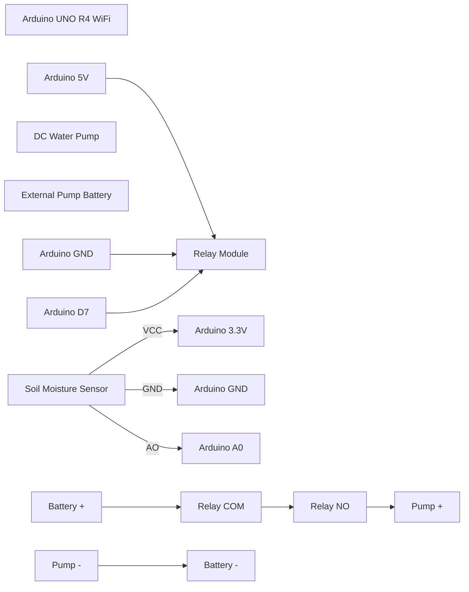

# Arduino UNO R4 WiFi Plant Watering System

## 1. Project Overview

This project is an automatic plant watering system using an **Arduino UNO R4 WiFi**, a **soil moisture sensor**, a **relay module**, and a **DC water pump**.

The system reads the soil moisture level from the sensor. If the soil becomes dry, the Arduino activates the relay, which powers the water pump. The Arduino also hosts a simple professional web dashboard over WiFi, so you can view live readings from a browser.

---

## 2. Components Used

- Arduino UNO R4 WiFi
- Soil moisture sensor module with pins: `AO`, `DO`, `GND`, `VCC`
- 1-channel relay module
- Mini DC water pump
- External pump battery / power source
- Jumper wires
- Breadboard
- USB-C cable or 5V 2A power bank / phone charger for Arduino
- WiFi hotspot named `Tanny`

---

## 3. Important Notes From Testing

Your measured sensor values were:

| Condition | Soil Sensor Raw Value |
|---|---:|
| Sensor dry / on table | about `422–428` |
| Sensor with wet tissue | about `242–259` |
| Sensor in water | mostly `252–282`, sometimes up to `378` |

For your sensor:

- **Higher value = drier soil**
- **Lower value = wetter soil**

Because your dry value is around `422–428`, the pump threshold must be much lower than the earlier `550/600` value.

Final chosen thresholds:

```text
Pump turns ON  when soil value >= 400
Pump turns OFF when soil value <= 380
```

---

## 4. Circuit Connections

### 4.1 Soil Moisture Sensor

Use the analog output pin only.

| Sensor Pin | Arduino UNO R4 WiFi Pin |
|---|---|
| `VCC` | `3.3V` |
| `GND` | `GND` |
| `AO` | `A0` |
| `DO` | Not connected |

> Do not use `DO` for this project. `AO` gives the real analog moisture value.

---

### 4.2 Relay Control Side

| Relay Pin | Arduino UNO R4 WiFi Pin |
|---|---|
| `VCC` | `5V` |
| `GND` | `GND` |
| `IN` | `D7` |

Most small relay modules are **active LOW**, meaning:

```cpp
digitalWrite(RELAY_PIN, LOW);  // relay ON
digitalWrite(RELAY_PIN, HIGH); // relay OFF
```

---

### 4.3 Pump Power Side

The pump must **not** be powered directly from the Arduino.

Use an external battery or power supply for the pump.

| Connection | Goes To |
|---|---|
| Battery `+` | Relay `COM` |
| Relay `NO` | Pump `+` |
| Pump `-` | Battery `-` |

Use the relay terminals:

```text
COM = common terminal
NO  = normally open terminal
NC  = normally closed terminal, not used here
```

For your relay orientation, the middle screw terminal was `COM`, and the bottom screw terminal was `NO`.

---

## 5. ASCII Circuit Diagram

```text
                       Arduino UNO R4 WiFi
                    +------------------------+
                    |                        |
Soil Sensor VCC ----| 3.3V                   |
Soil Sensor GND ----| GND                    |
Soil Sensor AO  ----| A0                     |
                    |                        |
Relay VCC ----------| 5V                     |
Relay GND ----------| GND                    |
Relay IN  ----------| D7                     |
                    +------------------------+


                    Relay Module
              +---------------------+
Arduino 5V -->| VCC                 |
Arduino GND ->| GND                 |
Arduino D7 -->| IN                  |
              |                     |
Battery + --->| COM                 |
              | NO ---------------> Pump +
              | NC   not used       |
              +---------------------+

Battery - -------------------------> Pump -
```

---

## 6. Mermaid Circuit Diagram

Some Markdown viewers support Mermaid diagrams. If supported, this will render as a diagram.



---

## 7. Power Advice

For stable operation:

- Power the **Arduino UNO R4 WiFi** from a USB-C charger or power bank rated around **5V 2A**.
- Power the **pump separately** through the relay.
- Do not power the pump from the Arduino 5V pin.
- Do not rely on a small rectangular 9V battery for the whole system.
- If the Arduino works from laptop USB but the dashboard does not appear when using a battery, the battery is probably not providing stable enough power for WiFi.

---

## 8. Final Arduino Code With Dashboard

Upload this complete code to the Arduino UNO R4 WiFi.

```cpp
#include <WiFiS3.h>

// ===================== WIFI SETTINGS =====================
char ssid[] = "Tanny";
char pass[] = "israttan";

WiFiServer server(80);

// ===================== PIN SETTINGS =====================
const int SENSOR_PIN = A0;
const int RELAY_PIN  = 7;

// Most 1-channel relay modules are ACTIVE LOW
const int RELAY_ON  = LOW;
const int RELAY_OFF = HIGH;

// ===================== CALIBRATION =====================
// Based on measured readings:
// Dry / table value: about 422 to 428
// Wet tissue value: about 242 to 259
// Water value: mostly 252 to 282, sometimes up to 378
//
// Higher value = drier
// Lower value = wetter

const int WET_RAW = 250;
const int DRY_RAW = 430;

// Pump ON when soil value is this high or higher
const int PUMP_START_DRY = 400;

// Pump OFF when soil value becomes this low or lower
const int PUMP_STOP_WET = 380;

// ===================== TIMING SETTINGS =====================
const unsigned long READ_INTERVAL_MS = 1000;
const unsigned long PUMP_MAX_ON_MS   = 5000;
const unsigned long PUMP_REST_MS     = 15000;
const unsigned long WIFI_RETRY_MS    = 10000;

// ===================== VARIABLES =====================
int soilRaw = 0;
int moisturePercent = 0;

bool pumpOn = false;
bool serverStarted = false;

unsigned long lastReadAt = 0;
unsigned long pumpStartedAt = 0;
unsigned long pumpStoppedAt = 0;
unsigned long lastWiFiTryAt = 0;

String systemMessage = "System starting";

void setup() {
  Serial.begin(9600);
  delay(1500);

  pinMode(RELAY_PIN, OUTPUT);
  digitalWrite(RELAY_PIN, RELAY_OFF);

  Serial.println();
  Serial.println("Plant Watering System Starting...");
  Serial.println("Relay is OFF at startup");

  connectWiFi();
}

void loop() {
  maintainWiFi();
  readSoilAndControlPump();
  handleClient();
}

// ===================== WIFI =====================

void connectWiFi() {
  Serial.print("Connecting to WiFi: ");
  Serial.println(ssid);

  for (int attempt = 1; attempt <= 20; attempt++) {
    if (WiFi.status() == WL_CONNECTED) {
      break;
    }

    Serial.print("WiFi attempt ");
    Serial.print(attempt);
    Serial.print(" ... ");

    WiFi.begin(ssid, pass);
    delay(2000);

    if (WiFi.status() == WL_CONNECTED) {
      Serial.println("connected");
      break;
    } else {
      Serial.println("failed");
    }
  }

  if (WiFi.status() == WL_CONNECTED) {
    server.begin();
    serverStarted = true;

    Serial.println();
    Serial.println("WiFi connected!");
    Serial.print("Open dashboard: http://");
    Serial.println(WiFi.localIP());
  } else {
    Serial.println();
    Serial.println("WiFi FAILED.");
    Serial.println("Auto watering will still work, but dashboard will not open.");
    Serial.println("Check hotspot name, password, and power supply.");
  }
}

void maintainWiFi() {
  if (WiFi.status() == WL_CONNECTED) {
    if (!serverStarted) {
      server.begin();
      serverStarted = true;

      Serial.println("WiFi reconnected!");
      Serial.print("Open dashboard: http://");
      Serial.println(WiFi.localIP());
    }
    return;
  }

  serverStarted = false;

  unsigned long now = millis();

  if (now - lastWiFiTryAt >= WIFI_RETRY_MS) {
    lastWiFiTryAt = now;

    Serial.println("WiFi disconnected. Retrying...");
    WiFi.begin(ssid, pass);
  }
}

// ===================== SENSOR =====================

int readStableSoilValue() {
  long total = 0;

  for (int i = 0; i < 30; i++) {
    total += analogRead(SENSOR_PIN);
    delay(3);
  }

  return total / 30;
}

void readSoilAndControlPump() {
  unsigned long now = millis();

  if (now - lastReadAt < READ_INTERVAL_MS) {
    return;
  }

  lastReadAt = now;

  soilRaw = readStableSoilValue();

  // Convert raw value to estimated moisture percentage:
  // DRY_RAW = 0%
  // WET_RAW = 100%
  moisturePercent = map(soilRaw, DRY_RAW, WET_RAW, 0, 100);
  moisturePercent = constrain(moisturePercent, 0, 100);

  bool soilIsDry = soilRaw >= PUMP_START_DRY;
  bool soilIsWet = soilRaw <= PUMP_STOP_WET;

  if (pumpOn && now - pumpStartedAt >= PUMP_MAX_ON_MS) {
    stopPump("safety timer reached");
  }

  else if (pumpOn && soilIsWet) {
    stopPump("soil is wet enough");
  }

  else if (!pumpOn && soilIsDry) {
    bool pumpRestFinished = (pumpStoppedAt == 0) || (now - pumpStoppedAt >= PUMP_REST_MS);

    if (pumpRestFinished) {
      startPump("soil is dry");
    } else {
      systemMessage = "Soil is dry, waiting before next watering";
    }
  }

  else if (!pumpOn && soilIsWet) {
    systemMessage = "Soil is wet enough";
  }

  else if (!pumpOn) {
    systemMessage = "Soil moisture is okay";
  }

  Serial.print("Soil: ");
  Serial.print(soilRaw);
  Serial.print(" | Moisture: ");
  Serial.print(moisturePercent);
  Serial.print("% | Pump: ");
  Serial.print(pumpOn ? "ON" : "OFF");
  Serial.print(" | Message: ");
  Serial.print(systemMessage);
  Serial.print(" | IP: ");

  if (WiFi.status() == WL_CONNECTED) {
    Serial.println(WiFi.localIP());
  } else {
    Serial.println("WiFi not connected");
  }
}

// ===================== PUMP =====================

void startPump(const char* reason) {
  pumpOn = true;
  pumpStartedAt = millis();

  digitalWrite(RELAY_PIN, RELAY_ON);

  systemMessage = "Pump ON - ";
  systemMessage += reason;

  Serial.println(systemMessage);
}

void stopPump(const char* reason) {
  pumpOn = false;
  pumpStoppedAt = millis();

  digitalWrite(RELAY_PIN, RELAY_OFF);

  systemMessage = "Pump OFF - ";
  systemMessage += reason;

  Serial.println(systemMessage);
}

// ===================== WEB SERVER =====================

void handleClient() {
  if (WiFi.status() != WL_CONNECTED) {
    return;
  }

  WiFiClient client = server.available();

  if (!client) {
    return;
  }

  String request = "";
  unsigned long startTime = millis();

  while (client.connected() && millis() - startTime < 1200) {
    while (client.available()) {
      char c = client.read();
      request += c;

      if (request.endsWith("\r\n\r\n")) {
        break;
      }
    }

    if (request.endsWith("\r\n\r\n")) {
      break;
    }
  }

  if (request.indexOf("GET /data") >= 0) {
    sendData(client);
  }

  else if (request.indexOf("GET /water") >= 0) {
    if (!pumpOn) {
      startPump("manual dashboard watering");
    }
    sendData(client);
  }

  else {
    sendDashboard(client);
  }

  delay(1);
  client.stop();
}

void sendHeader(WiFiClient &client, const char* contentType) {
  client.println("HTTP/1.1 200 OK");
  client.print("Content-Type: ");
  client.println(contentType);
  client.println("Cache-Control: no-store, no-cache, must-revalidate, max-age=0");
  client.println("Pragma: no-cache");
  client.println("Expires: 0");
  client.println("Access-Control-Allow-Origin: *");
  client.println("Connection: close");
  client.println();
}

void sendData(WiFiClient &client) {
  sendHeader(client, "application/json; charset=utf-8");

  client.print("{");

  client.print("\"soil\":");
  client.print(soilRaw);

  // Legacy field, so old cached dashboard code also works
  client.print(",\"moisture\":");
  client.print(soilRaw);

  client.print(",\"percent\":");
  client.print(moisturePercent);

  client.print(",\"pump\":");
  client.print(pumpOn ? 1 : 0);

  // Legacy field, so old cached dashboard code also works
  client.print(",\"limit\":");
  client.print(PUMP_START_DRY);

  client.print(",\"startDry\":");
  client.print(PUMP_START_DRY);

  client.print(",\"stopWet\":");
  client.print(PUMP_STOP_WET);

  client.print(",\"wetRaw\":");
  client.print(WET_RAW);

  client.print(",\"dryRaw\":");
  client.print(DRY_RAW);

  client.print(",\"ip\":\"");
  client.print(WiFi.localIP());
  client.print("\"");

  client.print(",\"message\":\"");
  client.print(systemMessage);
  client.print("\"");

  client.println("}");
}

void sendDashboard(WiFiClient &client) {
  sendHeader(client, "text/html; charset=utf-8");

  client.println(R"rawliteral(
<!DOCTYPE html>
<html>
<head>
<meta charset="UTF-8">
<title>Plant Watering Dashboard</title>
<meta name="viewport" content="width=device-width, initial-scale=1.0">

<style>
* {
  box-sizing: border-box;
}

body {
  margin: 0;
  font-family: Arial, sans-serif;
  background: linear-gradient(135deg, #0f172a, #064e3b);
  color: white;
  min-height: 100vh;
  padding: 24px;
}

.container {
  max-width: 1100px;
  margin: auto;
}

.header {
  margin-bottom: 24px;
}

.header h1 {
  font-size: 36px;
  margin: 0;
  letter-spacing: -0.5px;
}

.header p {
  color: #cbd5e1;
  margin-top: 8px;
  font-size: 16px;
}

.grid {
  display: grid;
  grid-template-columns: repeat(auto-fit, minmax(230px, 1fr));
  gap: 20px;
}

.card {
  background: rgba(255,255,255,0.13);
  border: 1px solid rgba(255,255,255,0.2);
  border-radius: 20px;
  padding: 24px;
  box-shadow: 0 20px 40px rgba(0,0,0,0.25);
}

.label {
  color: #cbd5e1;
  font-size: 14px;
  margin-bottom: 10px;
}

.value {
  font-size: 42px;
  font-weight: bold;
  margin-top: 8px;
}

.unit {
  font-size: 20px;
  color: #cbd5e1;
}

.bar {
  height: 18px;
  background: rgba(255,255,255,0.22);
  border-radius: 999px;
  overflow: hidden;
  margin-top: 15px;
}

.fill {
  height: 100%;
  width: 0%;
  background: #22c55e;
  transition: width 0.3s ease;
}

.badge {
  display: inline-block;
  padding: 10px 18px;
  border-radius: 999px;
  font-weight: bold;
  margin-top: 14px;
}

.on {
  background: #22c55e;
  color: #052e16;
}

.off {
  background: #ef4444;
  color: white;
}

.ok {
  color: #bbf7d0;
}

.warning {
  color: #fed7aa;
}

.error {
  color: #fecaca;
}

button {
  margin-top: 14px;
  border: none;
  padding: 12px 18px;
  border-radius: 12px;
  font-weight: bold;
  cursor: pointer;
  background: #38bdf8;
  color: #082f49;
}

button:hover {
  opacity: 0.9;
}

.info {
  margin-top: 22px;
  padding: 18px;
  border-radius: 16px;
  background: rgba(255,255,255,0.10);
  color: #e2e8f0;
  line-height: 1.8;
}

.small {
  color: #cbd5e1;
  font-size: 13px;
  margin-top: 8px;
}
</style>
</head>

<body>
<div class="container">

  <div class="header">
    <h1>Plant Watering Dashboard</h1>
    <p>Arduino UNO R4 WiFi live monitoring</p>
  </div>

  <div class="grid">

    <div class="card">
      <div class="label">Raw Soil Value</div>
      <div class="value" id="soilValue">--</div>
      <div class="small">Dry is higher, wet is lower</div>
    </div>

    <div class="card">
      <div class="label">Estimated Moisture</div>
      <div class="value">
        <span id="moisturePercent">--</span><span class="unit">%</span>
      </div>
      <div class="bar">
        <div class="fill" id="moistureBar"></div>
      </div>
    </div>

    <div class="card">
      <div class="label">Pump Status</div>
      <div class="value" id="pumpText">--</div>
      <div id="pumpBadge" class="badge off">STANDBY</div>
      <br>
      <button onclick="manualWater()">Water 5 seconds</button>
    </div>

    <div class="card">
      <div class="label">Pump Starts At</div>
      <div class="value" id="startDry">--</div>
      <div class="small">Pump turns ON at this value or higher</div>
    </div>

    <div class="card">
      <div class="label">Pump Stops At</div>
      <div class="value" id="stopWet">--</div>
      <div class="small">Pump turns OFF at this value or lower</div>
    </div>

    <div class="card">
      <div class="label">Calibration</div>
      <div class="value" style="font-size:28px;">
        <span id="wetRaw">--</span> / <span id="dryRaw">--</span>
      </div>
      <div class="small">Wet raw / dry raw calibration</div>
    </div>

  </div>

  <div class="info">
    <b>Status:</b> <span id="message">Waiting for data...</span><br>
    <b>Arduino IP:</b> <span id="ip">--</span><br>
    <b>Last Update:</b> <span id="lastUpdate">--</span>
  </div>

</div>

<script>
const soilValueEl = document.getElementById("soilValue");
const moisturePercentEl = document.getElementById("moisturePercent");
const moistureBarEl = document.getElementById("moistureBar");
const pumpTextEl = document.getElementById("pumpText");
const pumpBadgeEl = document.getElementById("pumpBadge");
const startDryEl = document.getElementById("startDry");
const stopWetEl = document.getElementById("stopWet");
const wetRawEl = document.getElementById("wetRaw");
const dryRawEl = document.getElementById("dryRaw");
const messageEl = document.getElementById("message");
const ipEl = document.getElementById("ip");
const lastUpdateEl = document.getElementById("lastUpdate");

async function updateDashboard() {
  try {
    const response = await fetch("/data?t=" + Date.now(), {
      cache: "no-store"
    });

    if (!response.ok) {
      throw new Error("HTTP status " + response.status);
    }

    const data = await response.json();

    soilValueEl.textContent = data.soil;
    moisturePercentEl.textContent = data.percent;
    moistureBarEl.style.width = data.percent + "%";

    startDryEl.textContent = data.startDry;
    stopWetEl.textContent = data.stopWet;
    wetRawEl.textContent = data.wetRaw;
    dryRawEl.textContent = data.dryRaw;

    messageEl.textContent = data.message;
    ipEl.textContent = data.ip;
    lastUpdateEl.textContent = new Date().toLocaleTimeString();

    if (data.pump === 1) {
      pumpTextEl.textContent = "ON";
      pumpBadgeEl.textContent = "WATERING";
      pumpBadgeEl.className = "badge on";
    } else {
      pumpTextEl.textContent = "OFF";
      pumpBadgeEl.textContent = "STANDBY";
      pumpBadgeEl.className = "badge off";
    }

    if (data.soil >= data.startDry) {
      messageEl.className = "warning";
    } else if (data.soil <= data.stopWet) {
      messageEl.className = "ok";
    } else {
      messageEl.className = "";
    }

  } catch (error) {
    messageEl.textContent = "Dashboard cannot read data from Arduino. Refresh page or check WiFi/power.";
    messageEl.className = "error";
    console.log(error);
  }
}

async function manualWater() {
  try {
    await fetch("/water?t=" + Date.now(), {
      cache: "no-store"
    });
    updateDashboard();
  } catch (error) {
    console.log(error);
  }
}

updateDashboard();
setInterval(updateDashboard, 1000);
</script>

</body>
</html>
)rawliteral");
}
```

---

## 9. How The Logic Works

The Arduino reads the analog value from the sensor using:

```cpp
analogRead(A0)
```

The value is averaged over 30 readings to reduce noise:

```cpp
for (int i = 0; i < 30; i++) {
  total += analogRead(SENSOR_PIN);
  delay(3);
}
```

Then the code checks:

```cpp
bool soilIsDry = soilRaw >= PUMP_START_DRY;
bool soilIsWet = soilRaw <= PUMP_STOP_WET;
```

If the soil is dry, the relay turns on:

```cpp
digitalWrite(RELAY_PIN, RELAY_ON);
```

The pump runs for a maximum of 5 seconds:

```cpp
const unsigned long PUMP_MAX_ON_MS = 5000;
```

Then it waits 15 seconds before watering again:

```cpp
const unsigned long PUMP_REST_MS = 15000;
```

This prevents the pump from running continuously and flooding the plant.

---

## 10. How To Use The Dashboard

1. Upload the Arduino code.
2. Open Serial Monitor at `9600 baud`.
3. Press the Arduino reset button.
4. Wait for a line like:

```text
Open dashboard: http://10.47.85.35
```

5. Open that address in your browser.
6. If the browser still shows an old dashboard, use:

```text
http://10.47.85.35/?v=final
```

or press:

```text
Ctrl + F5
```

---

## 11. Troubleshooting

### Problem: Arduino works on laptop USB but not on battery

Reason: the battery may not provide stable enough power for the WiFi board.

Fix:

- Use a USB-C power bank or phone charger rated around `5V 2A`.
- Keep the pump on a separate battery.

---

### Problem: Dashboard opens but values do not update

Fix:

- Open `/data` directly, for example:

```text
http://10.47.85.35/data
```

You should see JSON data like:

```json
{"soil":425,"percent":3,"pump":1,"startDry":400,"stopWet":380}
```

If `/data` works but the dashboard does not update, refresh with `Ctrl + F5`.

---

### Problem: Pump does not run, but dashboard says pump is ON

The code is working, but the hardware side has an issue.

Check:

```text
Relay VCC -> Arduino 5V
Relay GND -> Arduino GND
Relay IN  -> Arduino D7

Battery + -> Relay COM
Relay NO  -> Pump +
Pump -    -> Battery -
```

Also check whether the pump works directly from the battery.

---

### Problem: Pump turns on too often

Increase the start threshold:

```cpp
const int PUMP_START_DRY = 410;
```

or increase the rest time:

```cpp
const unsigned long PUMP_REST_MS = 30000;
```

---

### Problem: Pump does not turn on early enough

Lower the start threshold:

```cpp
const int PUMP_START_DRY = 390;
```

---

## 12. Final Recommended Settings

```cpp
const int WET_RAW = 250;
const int DRY_RAW = 430;
const int PUMP_START_DRY = 400;
const int PUMP_STOP_WET = 380;
```

These settings match your latest testing values.

---

## 13. Safety Notes

- Keep water away from the Arduino and laptop.
- Do not let exposed wires touch each other.
- Tighten relay screw terminals properly.
- Do not power the pump directly from Arduino.
- Use separate power for the pump.
- Use a stable USB-C power source for the Arduino.
- The resistive soil moisture sensor can corrode over time; a capacitive soil sensor is better for long-term use.

---

## 14. Project Summary

This system now has:

- Automatic watering based on soil moisture
- Calibrated thresholds from real sensor readings
- Relay-controlled external pump power
- Web dashboard hosted directly from the Arduino UNO R4 WiFi
- Live readings for raw soil value, estimated moisture, pump status, and thresholds
- Manual watering button from the dashboard
- Safety timer to prevent continuous pump operation
