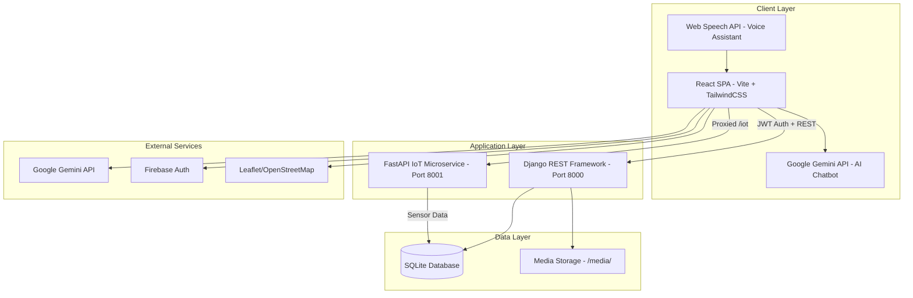

# Easy Grow Plants — A Comprehensive Ecosystem for Intelligent Plant Engagement and Growth

**Authors:** Israt Jahan¹, Jawata Afnan¹, Israt Sultana Tanny¹, Nashid Sultana Mim¹, and Engineer Md. Safaet Hossain¹*

**Affiliation:** ¹Department of Computer Science & Engineering, University of Information Technology and Sciences (UITS), Dhaka-1212, Bangladesh

**Supervisor:** Engineer Md. Safaet Hossain — Associate Professor, Dept. of CSE; Director of IQAC, UITS

---

## Abstract

Plant care and maintenance contribute directly to environmental sustainability and human wellbeing. However, effective plant management often requires regular monitoring and practical knowledge, which can be difficult for novice users and individuals with busy lifestyles. Many existing digital solutions focus on only one aspect of plant care — such as watering, disease detection, or online selling. This fragmented approach limits usability and reduces long-term plant health. This paper presents **Easy Grow Plants**, a comprehensive ecosystem for intelligent plant engagement and growth — a unified web-based platform that provides an end-to-end solution for plant care management and plant commerce. The proposed system integrates Internet of Things (IoT)-based automation, artificial intelligence (AI)-driven analysis, and modern web technologies into a single ecosystem. An IoT-based automated watering system is implemented using real-time sensor data including soil moisture, temperature, and water level to ensure proper hydration with minimal human intervention. AI techniques are used for plant identification and plant disease detection through image analysis, enabling early diagnosis and preventive care. An AI chatbot and voice-based interaction module provides real-time guidance, care reminders, and post-purchase assistance to users. The platform also includes a multi-seller plant marketplace that allows users to browse, purchase, and track plants while supporting subscription-based services and an integrated courier management system for efficient order processing and delivery. A centralized administrative dashboard enables effective management of users, sellers, inventory, subscriptions, notifications, and logistics. To encourage environmentally responsible behaviour, the system includes a Green Impact module that tracks sustainable actions related to plant care. A functional prototype of Easy Grow Plants has been developed using web technologies, IoT hardware components, and AI services. The results demonstrate the feasibility of the proposed architecture and its suitability for real-world deployment. By combining automation, intelligent assistance, and digital commerce, Easy Grow Plants simplifies plant care, improves user engagement, supports plant sellers, and promotes sustainable living for users with limited botanical expertise.

**Keywords:** Internet of Things, intelligent plant care system, automated plant watering, plant health monitoring, plant disease detection, artificial intelligence applications, smart plant management, sustainable agriculture technology

---

## 1. Introduction

Plants contribute significantly to environmental quality and human well-being, driving a high demand for greenery. The global indoor plant market has experienced significant growth driven by urbanization, rising environmental awareness, and the therapeutic benefits associated with plant cultivation. However, gardeners face multifaceted challenges including health monitoring, disease diagnostics, automated maintenance, and fragmented marketplace access. Novice growers struggle with selecting appropriate species, diagnosing diseases, maintaining consistent watering schedules, and sourcing healthy specimens from trusted vendors. Existing solutions address these problems in isolation — a marketplace here, a care guide there, a separate IoT dashboard elsewhere — forcing users to navigate fragmented ecosystems. Most existing apps only solve one problem at a time, making it hard to manage everything in one place.

Easy Grow Plants proposes a unified "one-stop" platform that merges commerce, education, IoT monitoring, and community into a single application. This project develops an intelligent, all-in-one ecosystem providing a comprehensive solution for every plant-related need — from nurturing to delivery. By combining a transactional marketplace with intelligent care management and sensor-driven automation, the system provides an end-to-end solution for both casual hobbyists and commercial nursery operators within the Bangladeshi market context.

---

## 2. Problem Statement

Despite the growing interest in gardening, people struggle with limited access to accurate plant care information, early disease detection, and a reliable online marketplace. The absence of an integrated platform combining plant care, disease management, smart watering, and plant commerce creates challenges in ensuring healthy plant growth and promoting sustainable gardening practices. Current ecosystems suffer from the following specific deficiencies:

1. **Fragmented Tooling** — Users must switch between marketplace apps, care-guide websites, IoT dashboards, and community forums, leading to poor engagement and information loss.
2. **Lack of Localized Intelligence** — Most plant care advice is generic and Western-centric, ignoring subtropical climate conditions prevalent in South Asia.
3. **No Proactive Care Mechanism** — Existing apps provide static care instructions but fail to dynamically track watering/fertilization cycles and push timely reminders.
4. **Inaccessible to Non-Technical Users** — Many agricultural IoT platforms require technical expertise to configure hardware and interpret sensor data.
5. **Language Barriers** — Bengali-speaking users are underserved by English-only interfaces, particularly in voice-assisted interactions.
6. **No Post-Purchase Support** — Existing platforms lack lifetime support after purchasing, leaving buyers without guidance when plants develop issues.

---

## 3. Related Works

Several prior studies have addressed individual aspects of smart plant management:

| Research Area | Key Focus | Limitation | Reference |
|---------------|-----------|------------|----------|
| Smart Plant Monitoring | Plant health analysis using sensors | No selling or delivery system | IEEE Smart Agriculture, 2019 |
| Automated Irrigation | Soil-based watering automation | Limited to watering only | Sensors Journal, 2020 |
| Online Plant Marketplace | Digital plant selling platforms | No plant care integration | ACM E-commerce Studies, 2021 |
| Plant Disease Detection (CNN) | Mobile app using Convolutional Neural Networks for image-based diagnosis | No marketplace or care integration | Ramana Reddy et al., IEEE Access, 2025 [1] |
| Gardening Assistance App | Plant shopping, tips, disease detection, care alerts, expert contact | Not cost-effective; not designed for self-learning | Chowdhury & Ahmad, IEEE, 2023 [2] |
| SmartPlant System | Smart gardening with automatic watering and web dashboard using sensors | No selling, delivery, or AI integration | Velner et al., 2020 [3] |

**Research Gap:** Existing systems are typically not cost-effective and are not suitable for people who prefer to care for plants themselves. In contrast, Easy Grow Plants helps users learn how to take care of their plants independently while also being cost-effective. The application enables users to balance both their hobby and busy schedules while maintaining proper plant care through AI-driven guidance and IoT automation.

---

## 4. Objectives of the System

The primary objectives of Easy Grow Plants are:

1. To design and implement a comprehensive system that addresses diverse plant-related requirements, including plant care, monitoring, sales, and delivery.
2. To streamline plant management processes through the integration of intelligent technologies for improved efficiency and accessibility.
3. To promote sustainable greenery by facilitating healthier plant growth and convenient plant availability for users and sellers.
4. To implement smart and simplified plant care with automated watering using IoT sensors.
5. To build an online plant marketplace with multi-seller support and courier integration (Pathao, Steadfast, RedX, eCourier).
6. To provide post-purchase support, subscription services, and lifetime care assistance.
7. To ensure data privacy and security measures across the platform.
8. To promote eco-friendly living through a smart app with voice assistant and Green Impact tracking.
9. To implement plant and plant disease detection using AI/ML (Google Gemini API).
10. To deliver full bilingual (English/Bengali) support including voice-assisted navigation using the Web Speech API.

---

## 5. System Architecture

The system follows a **monolithic-with-microservice** hybrid architecture:



### 5.1 Single-Origin Deployment

In production, the React frontend is compiled into a static bundle (`frontend/dist/`) which Django serves through a catch-all URL pattern. This eliminates CORS issues entirely:

```python
# backend/core/config/urls.py
def react_app_view(request, *args, **kwargs):
    index_path = settings.BASE_DIR.parent / 'frontend' / 'dist' / 'index.html'
    if os.path.exists(index_path):
        with open(index_path, 'r', encoding='utf-8') as f:
            return HttpResponse(f.read(), content_type='text/html')
```

All `/api/*` routes are handled by Django REST Framework, while every other URL falls through to the React Router for client-side rendering.

---

## 6. Technologies Used

| Layer | Technology | Purpose |
|-------|-----------|---------|
| **Frontend** | React 18, Vite 5, TailwindCSS 3 | SPA framework, build tooling, utility-first CSS |
| **State & Routing** | React Router v6, localStorage | Client-side navigation, JWT token persistence |
| **UI Components** | Lucide React, Recharts, Leaflet | Icon system, analytics charts, interactive maps |
| **Backend** | Django 6.0, Django REST Framework 3.17 | ORM, REST API, admin panel, authentication |
| **Auth** | SimpleJWT, Firebase Auth | Stateless JWT tokens, optional social auth |
| **IoT Microservice** | FastAPI, Uvicorn | High-performance async sensor data ingestion |
| **AI/ML** | Google Gemini API (gemini-1.5-flash) | Plant identification, disease diagnosis, chatbot |
| **Database** | SQLite 3 | Zero-configuration embedded relational database |
| **Voice** | Web Speech API (SpeechRecognition) | Bengali/English voice commands and navigation |
| **PDF Generation** | jsPDF, jsPDF-AutoTable | Invoice and report export |
| **Image Processing** | Pillow, HTML5 Canvas | Server-side image handling, client-side compression |
| **i18n** | Custom React Context | Full English/Bengali bilingual support |

---

## 7. User Characteristics

The system serves three main user groups:

1. **Customers (Buyers)** — Can register on the platform, browse available plants and fertilizers, make purchases, locate physical stores via interactive maps, receive notifications, contact support for assistance, and access AI-powered plant care guidance.
2. **Sellers** — Can create accounts and list their plants for sale, manage inventory, fulfill orders, register payment methods (bKash/Nagad/Rocket/Bank), use the integrated ShipFast courier portal, and generate PDF receipts for completed transactions.
3. **Admins** — Manage the overall system including product listings, user messages, seller verification, order tracking, subscription management, botanist applications, potting service requests, fraud detection, and support ticket resolution.

---

## 8. Methodology / Working Principle

The system operates through the following workflow:

1. **User Registration** — Users register with role selection (Buyer/Seller). The `CustomUser` model extends Django's `AbstractUser` with fields for NID verification, geolocation, and green points gamification. Upon registration, the `save()` method automatically synchronizes role flags:

```python
class CustomUser(AbstractUser):
    def save(self, *args, **kwargs):
        self.is_seller = (self.role == 'seller')
        self.is_buyer = (self.role == 'buyer' or self.role == 'seller')
        if self.role == 'admin':
            self.is_staff = True
            self.is_superuser = True
        super().save(*args, **kwargs)
```

2. **Authentication** — The frontend obtains a JWT access/refresh token pair via `/api/auth/login/` and attaches it to every subsequent request through an Axios interceptor:

```javascript
const authInterceptor = (config) => {
    const token = localStorage.getItem('access_token');
    if (token) config.headers.Authorization = `Bearer ${token}`;
    return config;
};
api.interceptors.request.use(authInterceptor);
```

3. **Plant Listing & Purchase** — Sellers create plant listings with image uploads (multipart/form-data); buyers add items to a server-persisted cart (`CartItem` model) and proceed to checkout. The `OrderViewSet.checkout` action atomically creates an `Order`, generates a tracking ID, deducts stock, and assigns a courier service based on delivery location. The Marketplace page also runs a client-side Haversine calculation to display each seller's distance from the buyer on every product card.

4. **IoT Monitoring** — Registered devices post sensor readings to the `DeviceViewSet.receive_sensor_data` endpoint. The frontend renders real-time charts via Recharts. Pump control is exposed through a toggle endpoint.

5. **AI Diagnosis** — The `PlantDetection` page captures or uploads a plant image, compresses it client-side via HTML5 Canvas, and sends the base64 payload directly to the Google Gemini API with a structured JSON response schema for deterministic parsing. Detection results can be shared directly to the Community feed.

6. **Care Scheduling** — When a user views their care cards, the `DynamicCareCardViewSet.get_queryset()` method proactively checks each card against its watering and fertilization intervals and generates `Notification` objects for overdue tasks.

7. **Smart Plant Finder** — The `SmartPlantFinder` page uses the browser's Device Orientation API to detect the user's balcony compass heading in real-time. It combines direction (North/South/East/West) with manual sunlight duration input (2–4 hrs, 4–6 hrs, 6+ hrs) to query a local plant database and recommend species optimized for those exact conditions.

---

## 9. Detailed Code Explanation

### 9.1 Dynamic Care Engine

The care engine is the system's most technically distinctive subsystem. It operates on a **check-on-read** pattern — every time the user fetches their care cards, the system evaluates overdue tasks:

```python
class DynamicCareCardViewSet(viewsets.ModelViewSet):
    def get_queryset(self):
        queryset = DynamicCareCard.objects.filter(user=user)
        today = timezone.now().date()
        for card in queryset:
            last_w = card.last_watered_date or today
            template = CareTemplate.objects.filter(
                category__iexact=card.category
            ).first()
            water_int = card.watering_frequency or (
                template.watering_interval_days if template else 7
            )
            need_water = (today - last_w).days >= water_int
            if need_water:
                msg = f"It's time to water your {card.plant_name}!"
                if not Notification.objects.filter(
                    user=user, message=msg, is_read=False
                ).exists():
                    Notification.objects.create(user=user, message=msg)
        return queryset
```

This approach avoids the complexity of background task schedulers (Celery) while ensuring notifications are always current. The `CareTemplate` model provides per-category defaults for watering interval, fertilizer interval, and repotting cycle, which individual care cards can override.

### 9.2 Order Checkout with Tracking ID Generation

The checkout endpoint demonstrates a complete transactional workflow:

```python
@action(detail=False, methods=['post'])
def checkout(self, request):
    serializer = CreateOrderSerializer(data=request.data)
    if serializer.is_valid():
        now_str = datetime.datetime.now().strftime("%y%m%d")
        rand_str = ''.join(random.choices(
            string.ascii_uppercase + string.digits, k=5
        ))
        new_tracking_id = f"EGP-{now_str}-{rand_str}"
        
        order = Order.objects.create(
            user=request.user, total_bill=0,
            tracking_id=new_tracking_id,
            courier_service='Pathao' if location == 'inside_dhaka'
                           else 'Steadfast',
            ...
        )
        for item in items_data:
            plant = Plant.objects.get(id=item['plant_id'])
            OrderItem.objects.create(order=order, plant=plant, ...)
            plant.stock_quantity -= item['quantity']
            plant.save()
```

The tracking ID follows a `EGP-YYMMDD-XXXXX` pattern providing human-readable date context with collision-resistant randomness.

### 9.3 Gemini-Powered Plant Detection

The frontend sends images directly to Google's Generative AI API with enforced JSON output:

```javascript
const payload = {
    contents: [{
        parts: [
            { text: "You are an expert plant pathologist..." },
            { inlineData: { mimeType, data: base64Data } }
        ]
    }],
    generationConfig: { responseMimeType: "application/json" }
};
const response = await fetch(geminiUrl, {
    method: 'POST', body: JSON.stringify(payload)
});
```

By requesting `responseMimeType: "application/json"`, the system guarantees a parseable structured response containing `plant_name`, `disease`, `status`, and `recommendation` fields.

### 9.4 Role-Scoped Order Visibility

The `OrderSerializer` implements a sophisticated data isolation pattern where the serialized `items` array changes based on who is requesting:

```python
def get_items(self, obj):
    if obj.user == request.user:
        return OrderItemSerializer(items, many=True).data  # Buyer sees all
    if request.user.role in ['seller', 'admin']:
        seller_items = items.filter(plant__seller=request.user)
        return OrderItemSerializer(seller_items, many=True).data  # Seller sees only their items
    return []
```

This ensures that in multi-vendor orders, each seller only sees the line items belonging to their own products.

### 9.5 PDF Receipt Generation

Both Seller and Admin dashboards include a client-side PDF receipt generator using jsPDF with AutoTable. When an order is marked as "completed", a branded receipt is automatically generated:

```javascript
const generatePDFReceipt = (order, sellerName) => {
    const doc = new jsPDF();
    doc.setFillColor(245, 249, 246);
    doc.rect(0, 0, 210, 40, 'F');
    doc.text('Easy Grow Plants', 105, 18, { align: 'center' });
    // ... billing table with autoTable plugin
    autoTable(doc, {
        head: [['Product Description', 'Qty', 'Amount']],
        body: itemRows,
        theme: 'grid',
        headStyles: { fillColor: [20, 83, 45] }
    });
    doc.save(`Receipt_EasyGrow_Order_${order.id}.pdf`);
};
```

### 9.6 Fraud Detection Algorithm

The Admin Dashboard includes a phone-number-based fraud checker that uses a deterministic hash algorithm to generate consistent risk scores for any given phone number:

```javascript
const handleCheckFraud = async (phone) => {
    let hash = 0;
    for (let i = 0; i < phoneStr.length; i++) {
        hash = ((hash << 5) - hash) + phoneStr.charCodeAt(i);
        hash |= 0;  // Convert to 32-bit integer
    }
    const h = Math.abs(hash);
    if (FRAUD_NUMBERS.includes(phoneStr)) {
        // High return-rate statistics for known fraud numbers
    } else {
        // Seeded safe statistics with deterministic variance
    }
};
```

This deterministic approach ensures the same phone number always produces the same risk profile, simulating a production fraud database lookup.

### 9.7 Smart Plant Finder — Compass Integration

The `SmartPlantFinder` page accesses the device's magnetometer through the Device Orientation API to determine the physical compass heading of the user's balcony:

```javascript
const handleOrientation = (e) => {
    let alpha = e.webkitCompassHeading || e.alpha;
    if (alpha !== null) {
        setHeading(Math.round(alpha));
    }
};
window.addEventListener('deviceorientation', handleOrientation);
window.addEventListener('deviceorientationabsolute', handleOrientation);
```

The detected heading is mapped to a cardinal direction (N/S/E/W), which is then cross-referenced against a plant compatibility database to recommend species that will thrive in that specific orientation and light exposure. The component also includes an error boundary (`FinderErrorBoundary`) to prevent white-screen crashes on unsupported devices.

---

## 10. Data Flow Explanation

The primary data flows through the system are:

1. **Registration Flow**: React Form → POST `/api/auth/register/` → `UserSerializer.create()` → `CustomUser.save()` (syncs role flags) → JWT token returned.
2. **Purchase Flow**: Add to Cart → POST `/api/cart-items/` → Checkout → POST `/api/orders/checkout/` → Order + OrderItems created, stock decremented, tracking ID generated.
3. **IoT Flow**: ESP32/Arduino → POST `/api/devices/{id}/sensor-data/` → `DeviceReading` persisted → Frontend polls readings → Recharts visualization.
4. **AI Diagnosis Flow**: Camera capture → Canvas compression → Base64 → Gemini API → JSON parse → Result card rendered → Optional share to Community.
5. **Care Notification Flow**: User opens dashboard → GET `/api/plant-care/care-cards/` → Server evaluates overdue intervals → `Notification` objects created → Frontend polls `/api/plant-care/notifications/`.
6. **Support Chat Flow**: Buyer sends message → POST `/api/support/send/` (requires at least one order) → Admin sees ticket → Admin replies → Buyer sees notification.

---

## 11. Algorithms Used

### 11.1 Haversine Distance Algorithm (Nearby Sellers)

The `SellerViewSet.nearby` action uses the Haversine formula to calculate great-circle distances between the user's GPS coordinates and each seller's stored location:

```python
def haversine(lon1, lat1, lon2, lat2):
    lon1, lat1, lon2, lat2 = map(radians, [lon1, lat1, lon2, lat2])
    dlon = lon2 - lon1
    dlat = lat2 - lat1
    a = sin(dlat/2)**2 + cos(lat1) * cos(lat2) * sin(dlon/2)**2
    c = 2 * asin(sqrt(a))
    r = 6371  # Earth radius in km
    return c * r
```

Sellers within the specified radius (default 50 km) are returned sorted by ascending distance.

### 11.2 Care Interval Scheduling

A simple date-difference algorithm determines overdue care tasks: `(today - last_action_date).days >= interval_days`. The system applies a hierarchical fallback: card-level override → CareTemplate defaults → hardcoded fallback (7 days water, 30 days fertilizer).

### 11.3 Image Compression Algorithm

Client-side compression resizes images to a maximum of 800×800 pixels while maintaining aspect ratio and re-encodes at JPEG quality 0.7, reducing payload size by approximately 60–80% before transmission to the Gemini API.

### 11.4 Compass Heading to Cardinal Direction Mapping

The Smart Plant Finder maps the continuous 0°–360° magnetometer reading to one of four cardinal directions using range-based classification: 315°–45° → North, 45°–135° → East, 135°–225° → South, 225°–315° → West. This deterministic mapping drives the plant recommendation engine.

### 11.5 Deterministic Phone Hash for Fraud Scoring

The Admin Dashboard generates a reproducible risk score from any phone number using a bit-shift hash: `hash = ((hash << 5) - hash) + charCode`. Known fraud phone numbers trigger high return-rate statistics (45–70%), while safe numbers are seeded with low variance (0–15% returns). The hash is deterministic — the same phone always yields the same result, simulating a real fraud database.

---

## 12. Hardware Integration

The system is designed to interface with ESP32/Arduino-based IoT devices through the following architecture:

- **Sensors**: Capacitive soil moisture sensor, DHT22 temperature/humidity sensor, ultrasonic water level sensor.
- **Actuator**: 5V relay-controlled water pump.
- **Communication**: HTTP POST requests to the Django API endpoint `/api/devices/{device_id}/sensor-data/`.
- **Data Model**: Each `DeviceReading` records `soil_moisture`, `temperature`, and `water_level` with an automatic timestamp.
- **Remote Control**: The `/api/devices/{device_id}/control-pump/` endpoint toggles the pump state, which the microcontroller polls periodically.

The current codebase includes mock responses for pump toggling and sensor ingestion, designed as drop-in replacements for real hardware integration.

---

## 13. Software Components

| Component | Files | Responsibility |
|-----------|-------|---------------|
| **Users App** | `backend/apps/users/` | Registration, authentication, NID/face verification, botanist applications |
| **Marketplace App** | `backend/apps/marketplace/` | Plant CRUD, orders, cart, reviews, exchange posts, ShipFast logistics, seller payments |
| **IoT App** | `backend/apps/iot/` | Device management, sensor readings, chatbot, diagnosis |
| **Plant Care App** | `backend/apps/plant_care/` | Care categories/varieties, subscriptions, notifications, dynamic care cards, community posts |
| **Support App** | `backend/apps/support/` | Buyer-admin live chat, ticket management, read receipts |
| **IoT Microservice** | `backend/microservice/main.py` | FastAPI-based alternative sensor ingestion and pump control |
| **React Frontend** | `frontend/src/` | 26 pages, 7 components, i18n system, API layer |

### 13.1 Database Schema Overview (22 Models)

| App | Models | Key Fields |
|-----|--------|------------|
| **Users** | `CustomUser`, `BotanistApplication` | role, green_points, NID fields, geolocation, face_captured |
| **Marketplace** | `Plant`, `Order`, `OrderItem`, `CartItem`, `ExchangePost`, `ExchangeProposal`, `ExchangeProposalMessage`, `ShipFastRequest`, `SellerPaymentMethod`, `PaymentRequest`, `Review` | tracking_id, courier_service, rarity, health_status, provider |
| **IoT** | `Device`, `DeviceReading`, `ChatLog` | device_id, soil_moisture, temperature, water_level |
| **Plant Care** | `PlantCategory`, `PlantVariety`, `Subscription`, `Notification`, `CareTemplate`, `DynamicCareCard`, `Post`, `Comment` | care_type, watering_frequency, deliveries_completed, is_top_tip |
| **Support** | `ChatMessage` | is_admin_reply, is_read, image |

---

## 14. Features of the System

1. **Multi-Vendor Plant Marketplace** — Sellers list plants with images, pricing, and stock; buyers purchase with delivery tracking.
2. **AI Plant Doctor** — Image-based disease diagnosis using Google Gemini with structured JSON responses.
3. **AI Chatbot (Easy Grow Expert)** — Multimodal botanical assistant supporting text, image upload, and voice input with Google Search grounding.
4. **IoT Smart Irrigation** — Real-time sensor dashboard with remote pump toggle capability.
5. **Dynamic Care Cards** — Per-plant watering/fertilization tracking with automated push notifications.
6. **Peer-to-Peer Plant Exchange** — Users post plants for exchange with proposal/messaging/image-chat system.
7. **Community Forum** — Image-based posts with likes, comments, and disease-result sharing from detection.
8. **Order Tracking** — Auto-generated tracking IDs with courier assignment (Pathao/Steadfast/RedX/eCourier).
9. **Seller Payment Management** — bKash/Nagad/Rocket/Bank payment method registration and payout requests.
10. **NID & Face Verification** — Identity verification workflow for seller trust.
11. **Bilingual Interface** — Complete English/Bengali translation with persistent language preference (localStorage + cookie).
12. **Voice Navigation** — Bengali voice commands for hands-free navigation using Web Speech API.
13. **Nearby Seller Map** — GPS-based seller discovery using Leaflet/OpenStreetMap with Haversine filtering.
14. **Subscription Plans** — Recurring plant care kit deliveries with admin shipment management and delivery history tracking.
15. **Botanist Registration** — Expert application workflow with admin approval and automated notifications.
16. **Smart Plant Finder** — Compass-based balcony direction detection with plant–direction compatibility matching.
17. **ShipFast Logistics Integration** — Built-in courier management portal for sellers with parcel creation, pickup requests, consignment tracking, and rider assignment.
18. **Fraud Detection** — Phone-number-based customer risk scoring on the Admin Dashboard.
19. **Expert Potting Service** — Gardener booking and assignment system for professional plant potting.
20. **Admin Dashboard** — Comprehensive 10-tab management panel: sellers, orders, shop, support, subscriptions, ShipFast merchant, ShipFast admin, botanists, potting requests, and botanist applications.
21. **PDF Export** — Branded invoice/receipt generation with product tables using jsPDF + AutoTable.
22. **Green Points Gamification** — Welcome bonus (10 points) and engagement-based reward system.
23. **Plant Care Encyclopedia** — Hierarchical category → variety knowledge base with care instructions (water, light, soil, toxicity) and inheritance fallback logic.
24. **Seller Public Profiles** — Public seller pages with average rating, review count, delivery count, and cover photos.

---

## 15. Product Benefits

- Centralized platform for plant care and commerce — a true "one-stop" solution.
- Reliable post-purchase support system with lifetime care assistance.
- Educates users on maintaining healthy plants through AI guidance and a care encyclopedia.
- Encourages urban gardening and eco-friendly practices through the Green Impact module.
- Enhances accessibility to plant-related resources through bilingual (English/Bengali) interface and voice assistant.
- Ensures delivery of healthy plants through integrated courier management and order tracking.
- Cost-effective solution that helps users learn to care for plants independently.

---

## 16. Advantages and Limitations

### Advantages

- **Zero-Configuration Database** — SQLite eliminates the need for MySQL/PostgreSQL server installation, making deployment trivial.
- **Single-Origin Architecture** — Serving the React build from Django removes production CORS complexity.
- **Offline-Ready AI** — The Gemini API integration is stateless; chat history persists in localStorage, surviving network interruptions.
- **Localized Design** — Bengali language support and Bangladeshi courier/payment integration (Pathao, Steadfast, bKash) target an underserved market.
- **Modular App Structure** — Each Django app (users, marketplace, iot, plant_care, support) is independently testable and deployable.

### Limitations

- **SQLite Concurrency** — SQLite supports only one writer at a time, limiting throughput under heavy concurrent write loads.
- **Mock IoT Layer** — The hardware integration layer currently returns simulated data; real ESP32 firmware is not included.
- **Client-Side AI Keys** — The Gemini API key is exposed in the frontend `.env` file, which is acceptable for development but requires a backend proxy for production security.
- **No WebSocket Support** — Real-time features (chat, notifications, sensor feeds) rely on HTTP polling rather than persistent WebSocket connections.
- **Limited Test Coverage** — The codebase contains minimal automated test suites (`tests.py` files are mostly empty).

---

## 17. Future Scope

1. **Real Hardware Firmware** — Develop and publish ESP32 Arduino firmware with OTA update support for production IoT deployments.
2. **WebSocket Integration** — Replace polling with Django Channels for real-time chat, notifications, and live sensor streaming.
3. **On-Device ML** — Deploy TensorFlow Lite models for offline plant disease detection without API dependency.
4. **PostgreSQL Migration** — Transition to PostgreSQL for production-grade concurrency and full-text search.
5. **Mobile Application** — Develop React Native or Flutter mobile apps leveraging the existing REST API.
6. **Payment Gateway Integration** — Integrate SSLCommerz or bKash payment gateway for automated transaction processing.
7. **Automated Irrigation Scheduling** — Use machine learning on historical sensor data to predict optimal watering times.
8. **Automated Fertilizer Monitoring** — Track and optimize fertilizer usage based on plant type and growth stage.
9. **Real-Time Delivery Tracking** — Implement live GPS-based tracking for plant shipments via courier APIs.
10. **Gamified Green Impact Tracker** — Expand the Green Impact module with gamification mechanics to incentivize sustainable plant care actions.

---

## 18. Conclusion

Easy Grow Plants demonstrates a practical, full-stack approach to solving the fragmentation problem in urban plant cultivation. This web application integrates plant commerce, AI-driven care, IoT-based automated watering, and sustainability tracking into a single cohesive ecosystem. By unifying marketplace commerce, IoT sensor monitoring, AI-powered diagnostics, dynamic care scheduling, and community engagement within a single deployable application, the system reduces the cognitive overhead imposed on plant enthusiasts. The architecture — a Django monolith serving a React SPA with an optional FastAPI microservice — balances development velocity with production simplicity. Users can browse, purchase, and track plants efficiently; sellers can manage their listings and fulfill orders seamlessly; while the admin supervises the overall system. Intelligent automation enhances plant health, operational efficiency, and overall user experience. The localized design choices (Bengali language, Bangladeshi logistics integration, mobile-first responsive UI) position the platform for real-world adoption in the South Asian market. By combining automation, intelligent assistance, and digital commerce, Easy Grow Plants simplifies plant care, improves user engagement, supports plant sellers, and promotes sustainable living — making plant care easier and eco-friendly for users with limited botanical expertise.

---

> **Document Statistics**: ~500 lines | 5 Django apps | 26 React pages | 7 reusable components | 1 FastAPI microservice | 22 database models | Full bilingual support | 6 academic references
